Conceptos generales
===================

Tecnologías inalámbricas
-------------------------

Las redes inalámbricas hacen uso de un medio sin cables para la transmisión de la información mediante ondas electromagnéticas. Actualmente su uso está ampliamente extendido debido al soporte tecnológico existente y a la movilidad que proporcionan. Se emplean diversas tecnologías según el ámbito en el que operan.

- Redes Personales: **WPAN** (Wireless PAN)
- Redes Locales: **WLAN** (Wireless LAN)
- Redes Metropolitanas: **WMAN** (Wireless MAN)
- Redes Amplias: **WWAN** (Wireless WAN)

Topología celular o en celdas
------------------------------

Las redes de telefonía móvil y otras redes inalámbricas similares están constituidas por un conjunto de estaciones cada una de las cuales tiene un área de cobertura. De esta forma, el territorio se divide en **celdas**, en teoría, de forma hexagonal, controladas cada una por una estación terrestre, que soportan un número limitado de llamadas. Cuando un usuario se encuentra en determinada célula, será atendido por su estación correspondiente. Pero si al desplazarse pasa a otra célula, entonces será otra estación la que le permita seguir manteniendo la conversación.

En las zonas limítrofes, las células se solapan, de forma que el usuario no pierda la cobertura cuando pasa de una a otra. Cada estación utiliza un rango de frecuencias específico y diferente del de las células que la rodean, que son adyacentes a ella, pues en caso contrario podrían producirse interferencias entre células. Células no adyacentes si pueden usar el mismo rango de frecuencias. El conjunto de todas las celdas de una red forman la zona de **cobertura**.

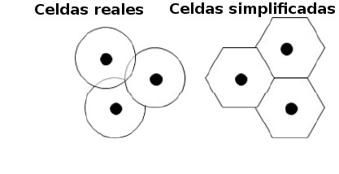

   Celdas reales vs simplificadas

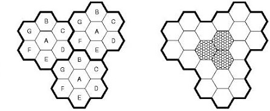

   Celdas simplificadas

Estándares
==========

A continuación se muestra un gráfico de tipos de redes inalámbricas atendiendo a su distancia y velocidades.

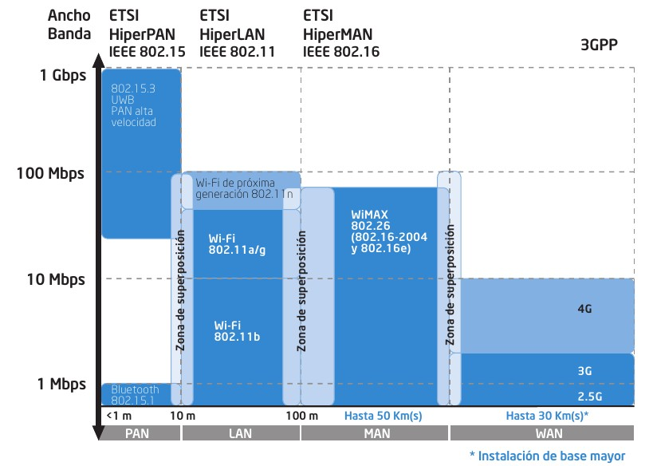

   Tecnologías inalámbricas - Comparativa

WPAN: Bluetooth
---------------

   Logo Bluetooth

Bluetooth es una especificación industrial para Redes Inalámbricas de Área Personal (WPAN) que posibilita la transmisión de voz y datos entre diferentes dispositivos mediante un enlace por radiofrecuencia en la **banda ISM de los 2,4 GHz**. Los principales objetivos que se pretenden conseguir con esta norma son:

- Facilitar las comunicaciones entre equipos móviles.
- Eliminar los cables y conectores entre éstos.
- Ofrecer la posibilidad de crear pequeñas redes inalámbricas y facilitar la sincronización de datos entre equipos personales.

Los dispositivos que con mayor frecuencia utilizan esta tecnología pertenecen a sectores de las telecomunicaciones y la informática personal, como PDA, teléfonos móviles, computadoras portátiles, ordenadores personales, impresoras o cámaras digitales.

Estos dispositivos se clasifican como "Clase 1", "Clase 2" o "Clase 3" en referencia a su potencia de transmisión. A mayor potencia mayor distancia.

======== =============================== ================================ ====================
Clase    Potencia máxima permitida (mW)  Potencia máxima permitida (dBm)  Alcance(aproximado)
======== =============================== ================================ ====================
Clase 1  100 mW                          20 dBm                           ~30 metros
Clase 2  2.5 mW                          4 dBm                            ~10-5 metros
Clase 3  1 mW                            0 dBm                            ~1 metro
======== =============================== ================================ ====================

En la mayoría de los casos, la cobertura efectiva de un dispositivo de clase 2 se extiende cuando se conecta a un transceptor de clase 1. Esto es así gracias a la mayor sensibilidad y potencia de transmisión del dispositivo de clase 1, es decir, la mayor potencia de transmisión del dispositivo de clase 1 permite que la señal llegue con energía suficiente hasta el de clase 2. Por otra parte la mayor sensibilidad del dispositivo de clase 1 permite recibir la señal del otro pese a ser más débil.

Los dispositivos con Bluetooth también pueden clasificarse según su ancho de banda:

===================== ====================
Versión               Ancho de banda
===================== ====================
Versión 1.2           1 Mbit/s
Versión 2.0 + EDR	  3 Mbit/s
Versión 3.0 + HS	  24 Mbit/s
Versión 4.0	          24 Mbit/s
===================== ====================

Las prestaciones fueron publicadas por el **Bluetooth Special Interest Group (SIG)**. El SIG las anunció formalmente el 20 de mayo de 1998. Hoy cuenta con una membresía de más de 14.000 empresas en todo el mundo. Fue creado por Ericsson, IBM, Intel, Toshiba y Nokia, y posteriormente se sumaron muchas otras compañías. Todas las versiones de los estándares de Bluetooth están diseñadas para la compatibilidad hacia abajo, que permite que el último estándar cubra todas las versiones anteriores.

WLAN: Wi-Fi
------------

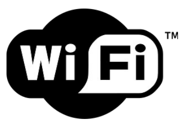
 
   Logo Wi-Fi

**Wi-Fi** (/ˈwaɪfaɪ/; en algunos países hispanoparlantes /ˈwifi/) es un mecanismo de conexión de dispositivos electrónicos de forma inalámbrica. Los dispositivos habilitados con Wi-Fi, tales como: un ordenador personal, una consola de videojuegos, un smartphone o un reproductor de audio digital, pueden conectarse a Internet a través de un punto de acceso de red inalámbrica. Dicho **punto de acceso** (o **hotspot**) tiene un alcance de unos 20 metros en interiores y al aire libre una distancia mayor. Pueden cubrir grandes áreas la superposición de múltiples puntos de acceso.

Esta nueva tecnología surgió por la necesidad de establecer un mecanismo de conexión inalámbrica que fuese compatible entre los distintos dispositivos. Buscando esa compatibilidad fue que en 1999 las empresas 3com, Airones, Intersil, Lucent Technologies, Nokia y Symbol Technologies se reunieron para crear la Wireless Ethernet Compatibility Alliance, o WECA, actualmente llamada **Wi-Fi Alliance**. El objetivo de la misma fue designar una marca que permitiese fomentar más fácilmente la tecnología inalámbrica y asegurar la compatibilidad de equipos.

De esta forma, en abril de 2000 WECA certifica la interoperabilidad de equipos según la norma IEEE 802.11b, bajo la marca Wi-Fi. Esto quiere decir que el usuario tiene la garantía de que todos los equipos que tengan el sello Wi-Fi pueden trabajar juntos sin problemas, independientemente del fabricante de cada uno de ellos. Se puede obtener un listado completo de equipos que tienen la certificación Wi-Fi en Alliance - Certified Products.

En el año 2002 la asociación WECA estaba formada ya por casi 150 miembros en su totalidad. La familia de **estándares 802.11** ha ido naturalmente evolucionando desde su creación, mejorando el rango y velocidad de la transferencia de información, entre otras cosas.

La norma IEEE 802.11 fue diseñada para sustituir el equivalente a las capas físicas y MAC de la norma 802.3 (Ethernet). Esto quiere decir que en lo único que se diferencia una red Wi-Fi de una red Ethernet es en cómo se transmiten las tramas o paquetes de datos; el resto es idéntico. Por tanto, una red local inalámbrica 802.11 es completamente compatible con todos los servicios de las redes locales (LAN) de cable 802.3 (Ethernet).

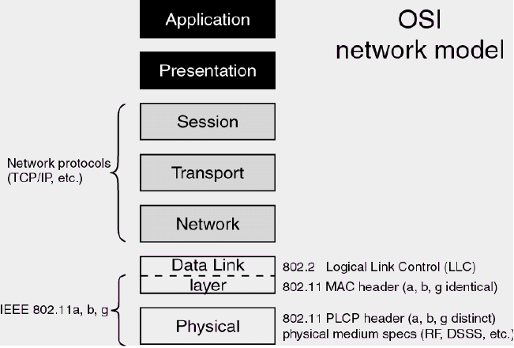

Trama 802.11 (Wi-Fi)
++++++++++++++++++++

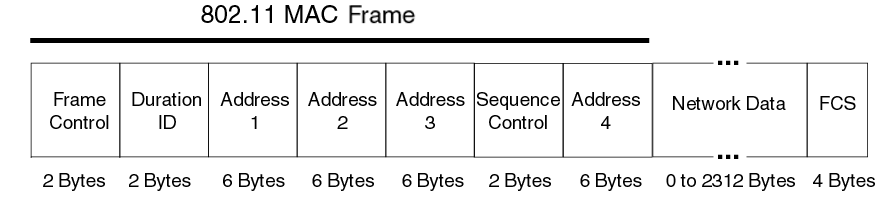

**Comparativa cabecera de trama wifi vs ethernet**

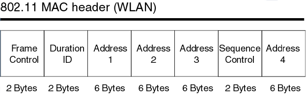

   **Cabecera 802.11**

   - **Dirección 1** (Destination Address (**DA**)): dirección MAC del nodo final.
   - **Dirección 2** (Source Address (**SA**)): dirección MAC del nodo inicial.
   - **Dirección 3** (Receiver Address (**RA**)): dirección MAC que identifica el dispositivo wireless que es el receptor inmediato de la trama.
   - **Dirección 4** (Transmitter Address (**TA**)): dirección MAC que identifica el dispositivo wireless que transmite la trama.

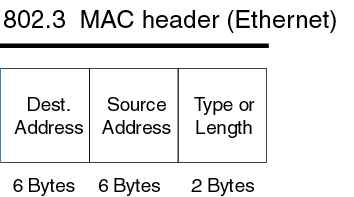

   **Cabecera 802.3**

   - **Dirección 1** (Destination Address (**DA**)): dirección MAC del nodo final.
   - **Dirección 2** (Source Address (**SA**)): dirección MAC del nodo inicial.

Normas 802.11 más importantes
++++++++++++++++++++++++++++++

La familia de estándares desarrollados por la IEEE para tecnologías de **red inalámbricas (redes wifi)**. Originalmente ofrecía una velocidad de transmisión de 1 o 2 Mbps en la banda de frecuencia wifi de **2.4 GHz**. Se le conoce popularmente como **WIFI (WIreless-FIdelity)**. Tiene un área de cobertura aproximada de 100 metros.

========== ============= ================= ==========
Norma      Velocidad     Frecuencia        Año
========== ============= ================= ==========
802.11a    54 Mbps       5 Ghz (OFDM)      1999
802.11b    11 Mbps       2,4 Ghz (DSSS)    1999
802.11g    54 Mbps       2,4 Ghz (OFDM)    2003
802.11G +  108 Mbps      2,4 Ghz 
802.11n    300 Mbps      2,4 / 5 Ghz       2009
802.11ac   1 Gbps        5 Ghz             2014
802.11ad   7 Gbps        2,4 / 5 / 60 Ghz  2015?
========== ============= ================= ==========

.. admonition: Siglas:

  - OFDM: Orthogonal Frecuency División Multiplexing
  - DSSS: Direct Sequencing Spread Spectrum

**Otras normas**

- **802.11h**: regula la potencia de emisión de las redes Wifi, el objetivo es cumplir los **reglamentos europeos para redes inalámbricas a 5 GHz**.
- **802.11i**: Estándar de seguridad para redes wifi aprobado a mediados de 2004. En él se define al protocolo de **encriptación WPA2** basado en el algoritmo AES. Pretende mejorar la seguridad del cifrado wifi y añadir autenticación.
- **802.11j**: Estándar wifi **equivalente al 802.11h, en la regulación japonesa**.
- **802.11ac**: Estándar de conexión WiFi en desarrollo, con notables mejorías respecto a 802.11n, para que sea de uso común se calcula que será en 2014. Se utiliza parte de los estándares 802.11a y n. **Puede suministrar una velocidad de transmisión de más de 1 Gbps en la banda de 5 GHz**.
- **802.11ad**: Una propuesta de un estándar de conexión WiFi diseñado con WiGig, la evolución del 802.11ac. Para que sea de uso popular se calcula que será en 2015. Se utiliza parte de los estándares 802.11n y ac. Puede suministrar una velocidad de transmisión de **hasta 7 Gbps teóricos** en la banda de 60 GHz sin licencia, aunque también funciona en la de 2,4 y 5GHz, serán **routers tri-banda**. La banda de 60 GHz será usada en enlaces de corta distancia, y su señal es muy direccional. Otra ventaja es que el consumo de energía disminuirá con una misma tasa de datos de 802.11n o ac, siendo más eficiente para móviles y portátiles.

Seguridad y fiabilidad
+++++++++++++++++++++++

Uno de los problemas a los cuales se enfrenta actualmente la tecnología Wi-Fi es la progresiva saturación del espectro radioeléctrico, debido a la masificación de usuarios, esto afecta especialmente en las conexiones de larga distancia (mayor de 100 metros). En realidad Wi-Fi está diseñado para conectar ordenadores a la red a distancias reducidas, cualquier uso de mayor alcance está expuesto a un excesivo riesgo de interferencias.

Un muy elevado porcentaje de redes son instalados sin tener en consideración la seguridad convirtiendo así sus redes en redes abiertas (o completamente vulnerables ante el intento de acceder a ellas por terceras personas), sin proteger la información que por ellas circulan. De hecho, la configuración por defecto de muchos dispositivos Wi-Fi es muy insegura (routers, por ejemplo) dado que a partir del identificador del dispositivo se puede conocer la clave de éste; y por tanto acceder y controlar el dispositivo se puede conseguir en sólo unos segundos.

El acceso no autorizado a un dispositivo Wi-Fi es muy peligroso para el propietario por varios motivos. El más obvio es que pueden utilizar la conexión. Pero además, accediendo al Wi-Fi se puede monitorizar y registrar toda la información que se transmite a través de él (incluyendo información personal, contraseñas....).

Existen varias alternativas para garantizar la seguridad de estas redes. Las más comunes son la utilización de protocolos de cifrado de datos para los estándares Wi-Fi como el WEP, el WPA, o el WPA2 que se encargan de codificar la información transmitida para proteger su confidencialidad, proporcionados por los propios dispositivos inalámbricos. La mayoría de las formas son las siguientes:

- WEP, cifra los datos en su red de forma que sólo el destinatario deseado pueda acceder a ellos. Los cifrados de 64 y 128 bits son dos niveles de seguridad WEP. WEP codifica los datos mediante una “clave” de cifrado antes de enviarlo al aire. Este tipo de cifrado no está muy recomendado debido a las grandes vulnerabilidades que presenta ya que cualquier cracker puede conseguir sacar la clave, incluso aunque esté bien configurado y la clave utilizada sea compleja.
- WPA: presenta mejoras como generación dinámica de la clave de acceso. Las claves se insertan como dígitos alfanuméricos.
- Filtrado de MAC, de manera que sólo se permite acceso a la red a aquellos dispositivos autorizados. Es lo más recomendable si solo se va a usar con los mismos equipos, y si son pocos.
- Ocultación del punto de acceso: se puede ocultar el punto de acceso (Router) de manera que sea invisible a otros usuarios.
- El protocolo de seguridad llamado WPA2 (estándar 802.11i), que es una mejora relativa a WPA. En principio es el protocolo de seguridad más seguro para Wi-Fi en este momento. Sin embargo requieren hardware y software compatibles, ya que los antiguos no lo son.

Sin embargo, no existe ninguna alternativa totalmente fiable, ya que todas ellas son susceptibles de ser vulneradas.

La **Wi-Fi Alliance** distingue:

- **WPA-Personal y WPA2-Personal** (con PSK, clave pre-compartida)
- **WPA-Enterprise y WPA2-Enterprise** (autenticación 802.1x/EAP)

Los fabricantes comenzaron a producir la nueva generación de puntos de accesos apoyados en el protocolo WPA2 que utiliza el algoritmo de **cifrado AES (Advanced Encryption Standard)** superior al TKIP utilizado en WPA.

El WPA-Enterprise requiere de una infraestructura de autenticación 802.1x con un **servidor de autenticación**, generalmente un **servidor RADIUS**. Este presta un servicio AAA (`Authentication, Authorization and Accounting`, ‘autenticación, autorización y contabilización’)

El problema de las claves compartidas está en que todo usuario con acceso a la red conoce la clave, por lo que, si se quiere retirar el acceso a un usuario o grupo de usuarios o si la clave es descubierta por personas no autorizadas, se debe cambiar la clave y comunicarla a todos los usuarios de la red para que la cambien en sus dispositivos, procedimiento que suele ser lento e inseguro. Este problema es especialmente preocupante en entornos empresariales o con muchos usuarios, como en los centros docentes y universitarios.

El **estándar IEEE 802.1x** ofrece una solución a este problema, tanto a redes 802.3 como a 802.11. Consiste en que **cada usuario tiene sus propias credenciales de acceso a la red y se autentica con ellas**, independientemente de que ademas se utilice o no una clave compartida para acceder a la red.

.. admonition:: Siglas:

  - PSK: PreShared Key
  - EAP: Extensible Authentication Protocol

WMAN: WiMAX
------------

WiMAX, siglas de Worldwide Interoperability for Microwave Access (interoperabilidad mundial para acceso por microondas), es una norma de transmisión de datos que utiliza las ondas de radio en las **frecuencias de 2,3 a 3,5 GHz** y puede tener una cobertura de **hasta 50 km y 70 Mbps**. En el estandar WiMAX2 (IEEE 802.16m) teóricamente sería posible alcanzar hasta 1 Gbps en reposo y 100 Mbps en movimiento en la descarga mediante la agrupación de canales.

Es una tecnología dentro de las conocidas como tecnologías de última milla, también conocidas como bucle local que permite la recepción de datos por microondas y retransmisión por ondas de radio. El estándar que define esta tecnología es el **IEEE 802.16**. Una de sus ventajas es dar servicios de banda ancha en zonas donde el despliegue de cable o fibra por la baja densidad de población presenta unos costos por usuario muy elevados (zonas rurales).

El único organismo habilitado para certificar el cumplimiento del estándar y la interoperabilidad entre equipamiento de distintos fabricantes es el **Wimax Forum**: todo equipamiento que no cuente con esta certificación, no puede garantizar su interoperabilidad con otros productos.

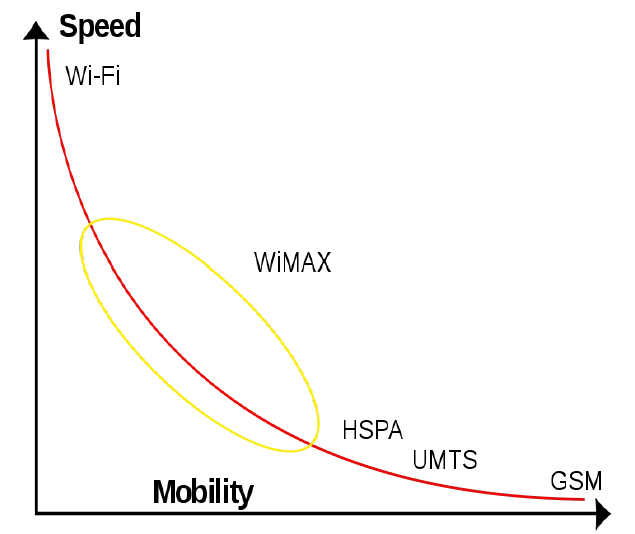

   Wireless Speed vs Mobility.png

El WiMAX se puede utilizar para una serie de aplicaciones, incluyendo conexiones de banda ancha para Internet, puntos de acceso, etc. Es similar a Wi-Fi, pero puede funcionar para distancias mucho mayores.

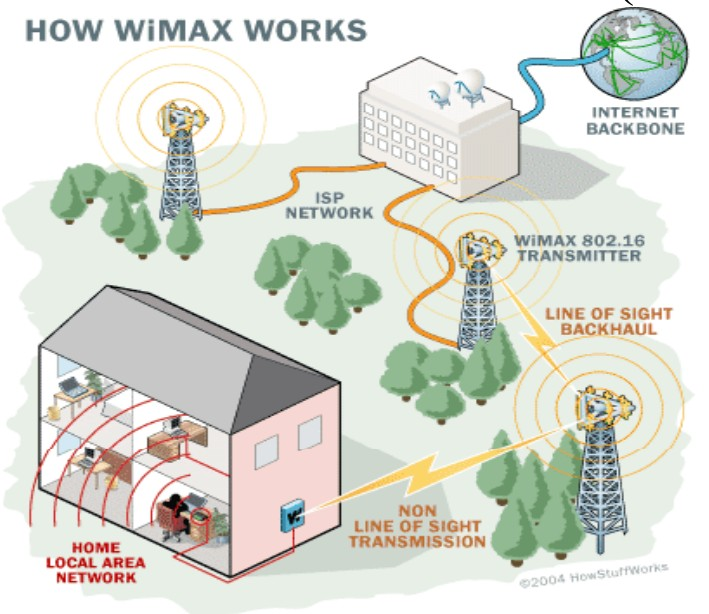

El ancho de banda y rango del WiMAX lo hacen adecuado para las siguientes aplicaciones potenciales:

- Proporcionar conectividad portátil de banda ancha móvil a través de ciudades y países por medio de una variedad de dispositivos.
- Proporcionar una alternativa inalámbrica al cable y línea de abonado digital (DSL) de "última milla" de acceso de banda ancha.
- Proporcionar datos, telecomunicaciones (VoIP) y servicios de IPTV (triple play).
- Proporcionar una fuente de conexión a Internet como parte de un plan de continuidad del negocio.
- Para redes inteligentes y medición.

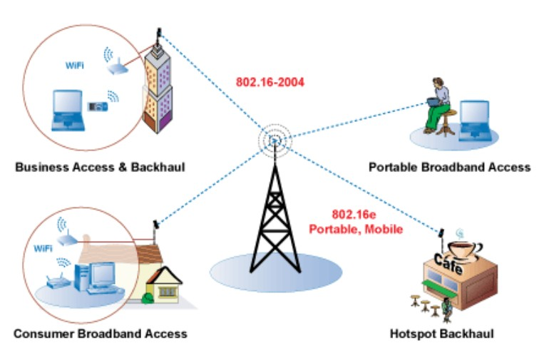

Puntos de acceso (AP: Access Point)
-----------------------------------

Uso de canales
++++++++++++++

Existen 14 canales, aunque en Europa solo se utilizan 13.

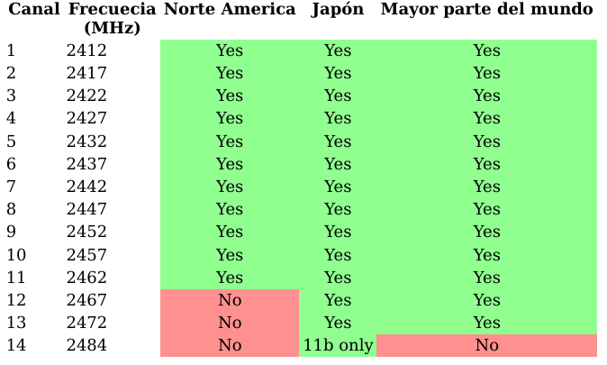

Si deseamos crear una red Wi-Fi cuya cobertura esté soportada por varios puntos de acceso, deberemos de establecer los canales de los distintos puntos de acceso de forma que no se solapen. Canales Wi-Fi en 2,4 GHz

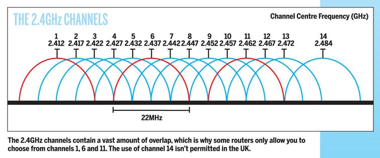

Por ello se recomienda utilizar los canales 1, 6 y 11. También pueden usarse 2, 7 y 12. Otra posibilidad son 3, 8 y 13.

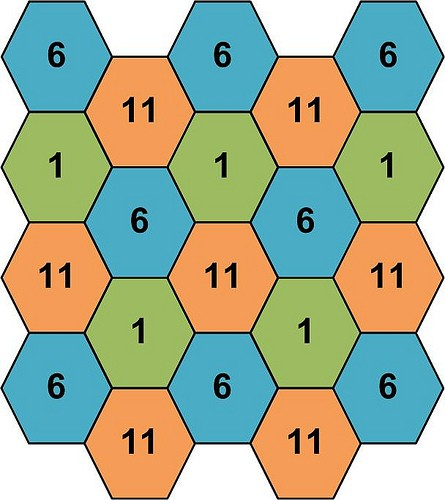

   Topología celular con canales 1, 6 y 11

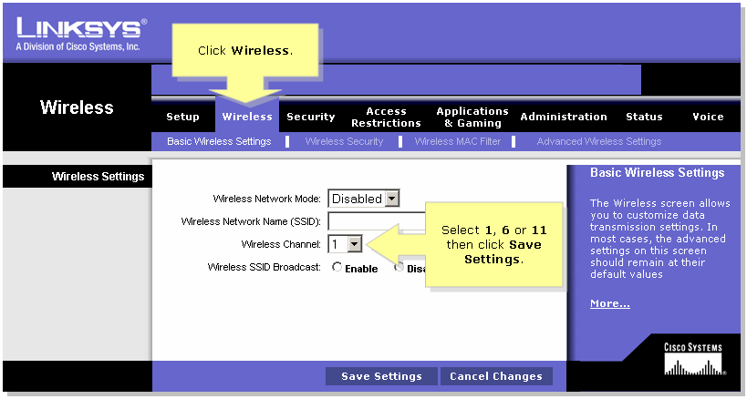

   Selección de canal en un punto de acceso

Modos básicos de funcionamiento
++++++++++++++++++++++++++++++++

Un punto de acceso (AP) puede configurar de muchas maneras, según la funcionalidad que queramos proporcionarle. Los modos básicos son:

- Modo punto de acceso
- Modo repetidor
- Modo puente (bridge)

**Modo Punto de Acceso**

En el modo de punto de acceso, los clientes deben utilizar el mismo SSID (nombre de red inalámbrica) y canal que el AP con el fin de conectarse. Si la seguridad inalámbrica está activada en el AP, será necesario que el cliente introduzca una contraseña para conectarse a la AP. En el modo de punto de acceso, múltiples clientes pueden conectarse al punto de acceso al mismo tiempo.

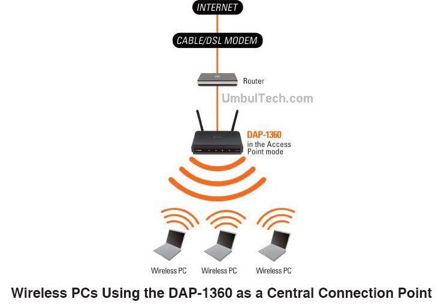

**Modo Repetidor**

En el modo de repetidor, el AP aumenta el alcance de la red inalámbrica mediante la ampliación de la cobertura inalámbrica de otro punto de acceso o router inalámbrico. Los puntos de acceso y router inalámbrico (si existiese) debe estar dentro del alcance del otro. Asegúrese de que todos los clientes, puntos de acceso y el router inalámbrico utilizan el mismo SSID (nombre de red inalámbrica) y el mismo canal.

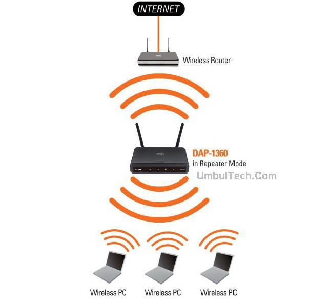

**Modo Puente (Bridge)**

En el modo de puente, el AP se conectan dos LAN separadas que no pueden ser fácilmente conectadas entre sí mediante un cable. Por ejemplo, si hay dos LANs cableadas separadas por un pequeño patio, sería costoso enterrar los cables para la conexión entre las dos partes. Una mejor solución es utilizar dos AP para conectar de forma inalámbrica las dos LAN. En el modo de puente, ambas unidades AP no actuan como puntos de acceso.

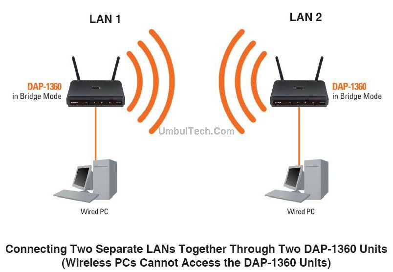

.. note::

  El modo de puente no se especifica en los estándares Wi-Fi o IEEE. Este modo sólo funciona con dos unidades idénticas que soporten este modo. La comunicación con otros puntos de acceso (incluso de la misma marca) no está garantizada.

Interconexión de dispositivos inalámbricos
+++++++++++++++++++++++++++++++++++++++++++

Existen dos modos:

- **Modo ad hoc (no se utiliza AP)**
- **Modo infraestructura**

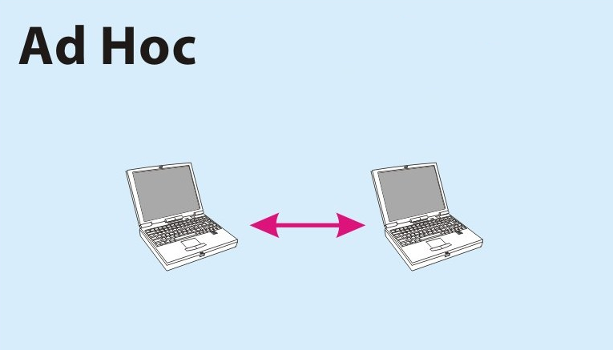

   Modo ad hoc (no se utiliza AP)

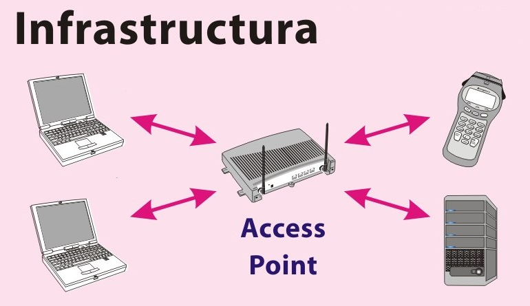

   Modo infraestructura

Routers inalámbricos
---------------------

Actualmente en hogares y pequeñas oficinas se utiliza frecuentemente unos dispositivos de enrutamiento básico entre la red local e Internet. Son **routers** que disponen de varios puertos RJ45 dispuestos a modo de **switch** y una antena que hace la función de **punto de acceso**.

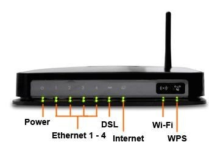

   Router inalámbrico
