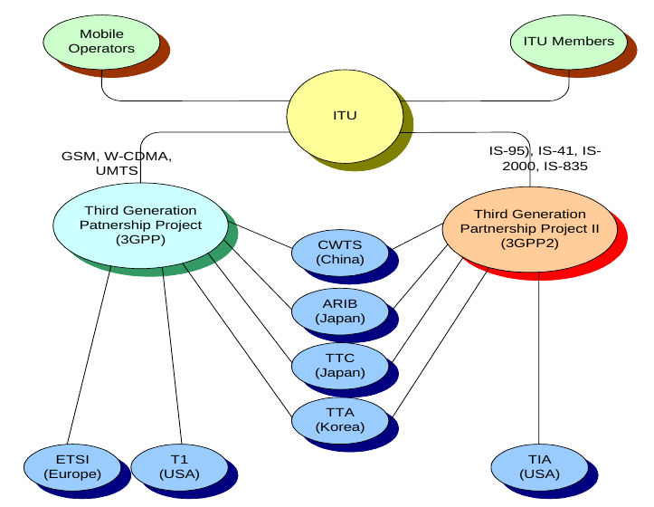
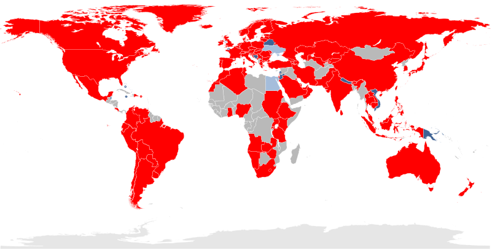
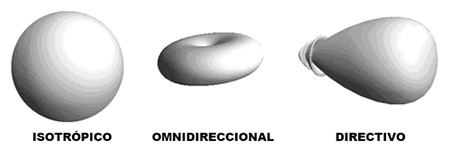
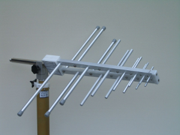
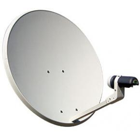
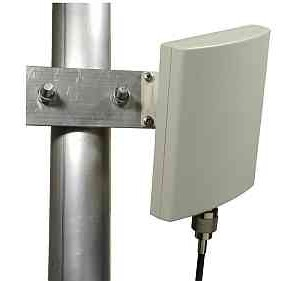
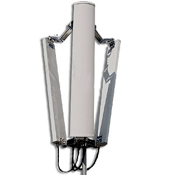

Conceptos generales
===================

Tecnologías inalámbricas
-------------------------

Las redes inalámbricas hacen uso de un medio sin cables para la transmisión de la información mediante ondas electromagnéticas. Actualmente su uso está ampliamente extendido debido al soporte tecnológico existente y a la movilidad que proporcionan. Se emplean diversas tecnologías según el ámbito en el que operan.

- Redes Personales: **WPAN** (Wireless PAN)
- Redes Locales: **WLAN** (Wireless LAN)
- Redes Metropolitanas: **WMAN** (Wireless MAN)
- Redes Amplias: **WWAN** (Wireless WAN)

Estándares
==========

A continuación se muestra un gráfico de tipos de redes inalámbricas atendiendo a su distancia y velocidades.

   Tecnologías inalámbricas - Comparativa

Normas 802.11 más importantes
++++++++++++++++++++++++++++++

La familia de estándares desarrollados por la IEEE para tecnologías de **red inalámbricas (redes wifi)**. Originalmente ofrecía una velocidad de transmisión de 1 o 2 Mbps en la banda de frecuencia wifi de **2.4 GHz**. Se le conoce popularmente como **WIFI (WIreless-FIdelity)**. Tiene un área de cobertura aproximada de 100 metros.

========== ============= ================= ==========
Norma      Velocidad     Frecuencia        Año
========== ============= ================= ==========
802.11a    54 Mbps       5 Ghz (OFDM)      1999
802.11b    11 Mbps       2,4 Ghz (DSSS)    1999
802.11g    54 Mbps       2,4 Ghz (OFDM)    2003
802.11G +  108 Mbps      2,4 Ghz 
802.11n    300 Mbps      2,4 / 5 Ghz       2009
802.11ac   1 Gbps        5 Ghz             2014
802.11ad   7 Gbps        2,4 / 5 / 60 Ghz  2015?
========== ============= ================= ==========

.. admonition: Siglas:

  - OFDM: Orthogonal Frecuency División Multiplexing
  - DSSS: Direct Sequencing Spread Spectrum

**Otras normas**

- **802.11h**: regula la potencia de emisión de las redes Wifi, el objetivo es cumplir los **reglamentos europeos para redes inalámbricas a 5 GHz**.
- **802.11i**: Estándar de seguridad para redes wifi aprobado a mediados de 2004. En él se define al protocolo de **encriptación WPA2** basado en el algoritmo AES. Pretende mejorar la seguridad del cifrado wifi y añadir autenticación.
- **802.11j**: Estándar wifi **equivalente al 802.11h, en la regulación japonesa**.
- **802.11ac**: Estándar de conexión WiFi en desarrollo, con notables mejorías respecto a 802.11n, para que sea de uso común se calcula que será en 2014. Se utiliza parte de los estándares 802.11a y n. **Puede suministrar una velocidad de transmisión de más de 1 Gbps en la banda de 5 GHz**.
- **802.11ad**: Una propuesta de un estándar de conexión WiFi diseñado con WiGig, la evolución del 802.11ac. Para que sea de uso popular se calcula que será en 2015. Se utiliza parte de los estándares 802.11n y ac. Puede suministrar una velocidad de transmisión de **hasta 7 Gbps teóricos** en la banda de 60 GHz sin licencia, aunque también funciona en la de 2,4 y 5GHz, serán **routers tri-banda**. La banda de 60 GHz será usada en enlaces de corta distancia, y su señal es muy direccional. Otra ventaja es que el consumo de energía disminuirá con una misma tasa de datos de 802.11n o ac, siendo más eficiente para móviles y portátiles.

Seguridad y fiabilidad
+++++++++++++++++++++++

Uno de los problemas a los cuales se enfrenta actualmente la tecnología Wi-Fi es la progresiva saturación del espectro radioeléctrico, debido a la masificación de usuarios, esto afecta especialmente en las conexiones de larga distancia (mayor de 100 metros). En realidad Wi-Fi está diseñado para conectar ordenadores a la red a distancias reducidas, cualquier uso de mayor alcance está expuesto a un excesivo riesgo de interferencias.

Un muy elevado porcentaje de redes son instalados sin tener en consideración la seguridad convirtiendo así sus redes en redes abiertas (o completamente vulnerables ante el intento de acceder a ellas por terceras personas), sin proteger la información que por ellas circulan. De hecho, la configuración por defecto de muchos dispositivos Wi-Fi es muy insegura (routers, por ejemplo) dado que a partir del identificador del dispositivo se puede conocer la clave de éste; y por tanto acceder y controlar el dispositivo se puede conseguir en sólo unos segundos.

El acceso no autorizado a un dispositivo Wi-Fi es muy peligroso para el propietario por varios motivos. El más obvio es que pueden utilizar la conexión. Pero además, accediendo al Wi-Fi se puede monitorizar y registrar toda la información que se transmite a través de él (incluyendo información personal, contraseñas....).

Existen varias alternativas para garantizar la seguridad de estas redes. Las más comunes son la utilización de protocolos de cifrado de datos para los estándares Wi-Fi como el WEP, el WPA, o el WPA2 que se encargan de codificar la información transmitida para proteger su confidencialidad, proporcionados por los propios dispositivos inalámbricos. La mayoría de las formas son las siguientes:

- WEP, cifra los datos en su red de forma que sólo el destinatario deseado pueda acceder a ellos. Los cifrados de 64 y 128 bits son dos niveles de seguridad WEP. WEP codifica los datos mediante una “clave” de cifrado antes de enviarlo al aire. Este tipo de cifrado no está muy recomendado debido a las grandes vulnerabilidades que presenta ya que cualquier cracker puede conseguir sacar la clave, incluso aunque esté bien configurado y la clave utilizada sea compleja.
- WPA: presenta mejoras como generación dinámica de la clave de acceso. Las claves se insertan como dígitos alfanuméricos.
- Filtrado de MAC, de manera que sólo se permite acceso a la red a aquellos dispositivos autorizados. Es lo más recomendable si solo se va a usar con los mismos equipos, y si son pocos.
- Ocultación del punto de acceso: se puede ocultar el punto de acceso (Router) de manera que sea invisible a otros usuarios.
- El protocolo de seguridad llamado WPA2 (estándar 802.11i), que es una mejora relativa a WPA. En principio es el protocolo de seguridad más seguro para Wi-Fi en este momento. Sin embargo requieren hardware y software compatibles, ya que los antiguos no lo son.

Sin embargo, no existe ninguna alternativa totalmente fiable, ya que todas ellas son susceptibles de ser vulneradas.

La **Wi-Fi Alliance** distingue:

- **WPA-Personal y WPA2-Personal** (con PSK, clave pre-compartida)
- **WPA-Enterprise y WPA2-Enterprise** (autenticación 802.1x/EAP)

Los fabricantes comenzaron a producir la nueva generación de puntos de accesos apoyados en el protocolo WPA2 que utiliza el algoritmo de **cifrado AES (Advanced Encryption Standard)** superior al TKIP utilizado en WPA.

El WPA-Enterprise requiere de una infraestructura de autenticación 802.1x con un **servidor de autenticación**, generalmente un **servidor RADIUS**. Este presta un servicio AAA (`Authentication, Authorization and Accounting`, ‘autenticación, autorización y contabilización’)

El problema de las claves compartidas está en que todo usuario con acceso a la red conoce la clave, por lo que, si se quiere retirar el acceso a un usuario o grupo de usuarios o si la clave es descubierta por personas no autorizadas, se debe cambiar la clave y comunicarla a todos los usuarios de la red para que la cambien en sus dispositivos, procedimiento que suele ser lento e inseguro. Este problema es especialmente preocupante en entornos empresariales o con muchos usuarios, como en los centros docentes y universitarios.

El **estándar IEEE 802.1x** ofrece una solución a este problema, tanto a redes 802.3 como a 802.11. Consiste en que **cada usuario tiene sus propias credenciales de acceso a la red y se autentica con ellas**, independientemente de que ademas se utilice o no una clave compartida para acceder a la red.

.. admonition:: Siglas:

  - PSK: PreShared Key
  - EAP: Extensible Authentication Protocol

WPS (Wi-Fi Protected Setup)
++++++++++++++++++++++++++++

WPS (Wi-Fi Protected Setup) es un estándar de 2007, promovido por la Wi-Fi Alliance para facilitar la creación de redes WLAN. En otras palabras, WPS no es un mecanismo de seguridad por sí, se trata de la definición de diversos mecanismos para facilitar la configuración de una red WLAN segura con WPA2, pensados para minimizar la intervención del usuario en entornos domésticos o pequeñas oficinas (**SOHO: Small Office Home Office**). Concretamente, WPS define los mecanismos a través de los cuales los diferentes dispositivos de la red obtienen las credenciales (SSID y PSK) necesarias para iniciar el proceso de autenticación.

.. figure:: images/tema07-016.png

.. figure:: images/tema07-018.png

**Arquitectura técnica**

WPS define una arquitectura con tres elementos con roles diferentes:

- **Registrar (matriculador)**: dispositivo con la autoridad de generar o revocar las credenciales en la red. Tanto un AP como cualquier otra estación o PC de la red pueden tener este rol. Puede haber más de un Registrar en una red.
- **Enrollee (matriculado)**: dispositivo que solicita el acceso a la red WLAN.
- **Authenticator (autenticador)**: AP funcionando de proxy entre el Registrar y el Enrollee.

**Métodos**

WPS contempla cuatro tipos de configuraciones diferentes para el intercambio de credenciales, PIN (Personal Identification Number), PBC (Push Button Configuration), NFC (Near Field Communications) y USB (Universal Serial Bus):

- **PIN**: tiene que existir un PIN asignado a cada elemento que vaya a asociarse a la red. Este PIN tiene que ser conocido tanto por el Registrar, como por el usuario (Enrollee). Es necesaria la existencia de una interfaz (e.g. pantalla y teclado) para que el usuario pueda introducir el mencionado PIN.
- **PBC**: la generación y el intercambio de credenciales son desencadenados a partir que el usuario presiona un botón (físico o virtual) en el AP (o en otro elemento Registrar) y otro en el dispositivo. Notar que en el corto lapso de tiempo entre que se presiona el botón en el AP y se presiona en el dispositivo, cualquier otra estación próxima puede ganar acceso a la red.
- **NFC**: intercambio de credenciales a través de comunicación NFC. La tecnología NFC (Near Field Communication), basada en RFID (Radio Frequency IDentification) permite la comunicación sin hilos entre dispositivos próximos (0 - 20 cm). Entonces, el dispositivo Enrollee se tiene que situar al lado del Registrar para desencadenar la autenticación. De esta manera, cualquier usuario que tenga acceso físico al Registrar, puede obtener credenciales válidas.
- **USB**: con este método, las credenciales se transfieren mediante un dispositivo de memoria flash (e.g. pendrive) desde el Registrar al Enrollee.

Los métodos PBC, NFC y USB pueden usarse para configurar dispositivos sin pantalla ni teclado (e.g. impresoras, webcams, etc.), pero aunque el estándar contempla NFC y USB, todavía no se certifican estos mecanismos. Actualmente sólo el método PIN es obligatorio en todas las estaciones para obtener la certificación WPS; PBC es obligatorio sólo en APs.

**Vulnerabilidades**

Existe una falla de seguridad descubierta en diciembre del 2011 por Stefan Viehböck, la cual afecta a routers inalámbricos que tienen la función WPS (también llamada **QSS: Quick Security Setup**), la misma que en dispositivos actuales se encuentra habilitada por defecto. La falla **permite a un atacante recuperar el PIN WPS y con la misma la clave pre-compartida de la red WPA/WPA2** usando ataques de fuerza bruta en pocas horas. Los usuarios deben deshabilitar la función WPS como solución temporal. En ciertos dispositivos, es posible que no se pueda realizar dicho procedimiento.

WMAN: WiMAX
------------

.. figure:: images/tema07-019.png

WiMAX, siglas de Worldwide Interoperability for Microwave Access (interoperabilidad mundial para acceso por microondas), es una norma de transmisión de datos que utiliza las ondas de radio en las **frecuencias de 2,3 a 3,5 GHz** y puede tener una cobertura de **hasta 50 km y 70 Mbps**. En el estandar WiMAX2 (IEEE 802.16m) teóricamente sería posible alcanzar hasta 1 Gbps en reposo y 100 Mbps en movimiento en la descarga mediante la agrupación de canales.

Es una tecnología dentro de las conocidas como tecnologías de última milla, también conocidas como bucle local que permite la recepción de datos por microondas y retransmisión por ondas de radio. El estándar que define esta tecnología es el **IEEE 802.16**. Una de sus ventajas es dar servicios de banda ancha en zonas donde el despliegue de cable o fibra por la baja densidad de población presenta unos costos por usuario muy elevados (zonas rurales).

El único organismo habilitado para certificar el cumplimiento del estándar y la interoperabilidad entre equipamiento de distintos fabricantes es el **Wimax Forum**: todo equipamiento que no cuente con esta certificación, no puede garantizar su interoperabilidad con otros productos.

   Wireless Speed vs Mobility.png

El WiMAX se puede utilizar para una serie de aplicaciones, incluyendo conexiones de banda ancha para Internet, puntos de acceso, etc. Es similar a Wi-Fi, pero puede funcionar para distancias mucho mayores.

.. figure:: images/tema07-022.png

El ancho de banda y rango del WiMAX lo hacen adecuado para las siguientes aplicaciones potenciales:

- Proporcionar conectividad portátil de banda ancha móvil a través de ciudades y países por medio de una variedad de dispositivos.
- Proporcionar una alternativa inalámbrica al cable y línea de abonado digital (DSL) de "última milla" de acceso de banda ancha.
- Proporcionar datos, telecomunicaciones (VoIP) y servicios de IPTV (triple play).
- Proporcionar una fuente de conexión a Internet como parte de un plan de continuidad del negocio.
- Para redes inteligentes y medición.

.. figure:: images/tema07-023.png

WiMAX vs LMDS
++++++++++++++

**LMDS (Local Multipont Delivery Service)**: es una tecnología inalámbrica de acceso a la banda ancha, es también denominada como **WiBAS (Wireless Broadband Access System)**.

- Es un servicio de acceso inalámbrico de banda ancha regulado por el IEEE y se describe el 802 por LAN/MAN Standards Committee a través de los esfuerzos del Grupo de Trabajo **IEEE 802.16.1**.
- Trabaja fundamentalmente en la banda de los **26 GHz** y los 29 GHz, según las regulaciones locales aplicables. En los Estados Unidos, las frecuencias de 31,0 a 31,3 GHz se consideran también las frecuencias de LMDS.
- Está pensada para trabajar en modo punto a punto o punto-multipunto.
- Las radiocomunicaciones en la banda de 26 GHz **necesitan visibilidad directa entre antenas**.
- El abastecimiento del servicio LMDS, viene **limitado por las características del medio** y las exigencias de disponibilidad contratadas, entre otros factores técnicos.
- Se puede hablar de **distancias máximas entre 2,5 Km y 14 Km**, aunque las utilizaciones típicas de LMDS acostumbran a cubrir distancias de entre 3 y 5 Km., con un grado de disponibilidad muy alto.

**WiMAX** es una tecnología basada en estándares que permite la entrega de última milla de acceso inalámbrico de banda ancha como una alternativa al cable y DSL".

- La tecnología se basa en el estándar IEEE 802.16 (también denominado Broadband Wireless Access).
- Trabaja en la banda de **2 a 11 GHz**, por tanto, no le afectan las limitaciones de propagación de la banda de 26 GHz.
- Proporciona transmisión inalámbrica de datos usando varios de modos de transmisión, de punto a multipunto para portátiles y acceso a Internet completamente móvil.
- Una diferencia principal es que WiMAX puede trabajar **tanto sin visibilidad directa, como con visibilidad directa**.
- Otra diferencia fundamental es la capacidad de WiMAX de **adaptarse a las condiciones variables del medio**, mediante mecanismos de control de potencia emitida, modulación adaptativa y selección automática de frecuencia que permiten una combinación de abastecimiento y de velocidad de transmisión de datos superior.

WWAN: 4G
--------

Evolución de la tecnología móvil
+++++++++++++++++++++++++++++++++

==================================== ========================================================================
Generación                           Tecnología
==================================== ========================================================================
0G                                   - Radio analógica AM/FM (años 40)

1G                                   - Primeros teléfonos móviles: FM (años 80)
                                     - **TACS** [Total Access Communication System]

2G                                   - Transmisión digital de voz (años 90)
                                     - **GSM** [Global System for Mobile Communications]

2G transitional (2.5G, 2.75G)        - Nuevos servicios, p.j. MMS
                                     - **GPRS** [General Packet Radio Service]
                                     - EDGE [Enhaced Data rates for GSM Evolution]

3G                                   - Transmisión digital de voz y datos
                                     - **UMTS** [Universal Mobile Telecommunications System]

3G transitional (3.5G, 3.75G, 3.9G)  - **HSPA** [High Speed Packet Access] / **LTE** [Long Term Evolution]

4G	LTE Advanced (E-UTRA)            - **E-UTRA (LTE Advanced)**
==================================== ========================================================================

3GPP
++++

El **Proyecto Asociación de Tercera Generación** o más conocido por el acrónimo inglés **3GPP 3rd Generation Partnership Project** es una colaboración de grupos de asociaciones de telecomunicaciones, conocidos como Miembros Organizativos.

**Miembros organizativos**

================================================================== ================ ====================
Organización                                                       Procedencia      Web
================================================================== ================ ====================
The Association of Radio Industries and Businesses (**ARIB**)	   Japón            www.arib.or.jp
The Alliance for Telecommunications Industry Solutions (**ATIS**)  Estados Unidos   www.atis.org
China Communications Standards Association (**CCSA**)	           China            www.ccsa.org.cn
The European Telecommunications Standards Institute (**ETSI**)	   Europa           www.etsi.org
Telecommunications Technology Association (**TTA**)                Corea del Sur    www.tta.or.kr
Telecommunication Technology Committee (**TTC**)                   Japón            www.ttc.or.jp
================================================================== ================ ====================

El objetivo inicial del 3GPP era asentar las especificaciones de un sistema global de comunicaciones de tercera generación 3G para móviles basándose en las especificaciones del sistema evolucionado "Global System for Mobile Communications" GSM dentro del marco del proyecto internacional de telecomunicaciones móviles 2000 de la Unión Internacional de Telecomunicaciones ITU. Más tarde el objetivo se amplió incluyendo el desarrollo y mantenimiento de:

- El Sistema Global de telecomunicaciones móviles GSM incluyendo las tecnologías de radio-acceso evolucionadas del GSM (cómo por ejemplo GPRS o el EDGE).
- Un sistema de tercera generación evolucionado y más allá del sistema móvil basado en las redes de núcleo evolucionadas del 3GPP y las tecnologías de radio-acceso apoyadas por los miembros del proyecto (cómo por ejemplo la tecnología UTRAN y sus modos FDD y TDD).
- Un Subsistema Multimedia IP (IMS) desarrollado en un acceso de forma independiente.

La estandarización 3GPP abarca radio, redes de núcleo y arquitectura de servicio. El proyecto 3GPP se estableció en Diciembre del año 1988 y no se tiene que confundir con el Proyecto Asociación de Tercera Generación 2 (3GPP2), que tiene por objetivo la especificación de los estándares por otra tecnología 3G basada en el sistema IS95 (CDMA), y que es más conocido por el acrónimo CDMA2000. El equipo de apoyo 3GPP, también conocido como el Centro de Competencias Móviles se encuentra situado en las oficinas de la ETSI en Sophia Antípolis (Francia).

Los sistemas 3GPP se encuentran desplegados por la mayoría del territorio donde el mercado GSM está establecido. Mayormente encontramos sistemas de Versión 6, pero desde 2010, con el mercado de teléfonos inteligentes creciendo de forma exponencial, el interés por los sistemas HSPA+ y LTE está impulsando a las compañías a adoptar sistemas Versión 7 y de más avanzados.

Desde 2005, los sistemas 3GPP están siendo desarrollados en los mismos mercados que los sistemas 3GPP2 de tecnología CDMA. Eventualmente los estándares 3GPP2 desaparecerán dejando a los 3GPP como únicos estándares de tecnología móvil.

   3GPP vs 3GPP2

LTE
++++

3GPP Long Term Evolution Country Map.svg

   Lugares donde se ha adoptado la tecnología LTE (Julio 2017)

   - En ROJO: Lugares con servicios de LTE comercial
   - En AZUL: Lugares con despliegue de red LTE comercial en marcha o en proyecto
   - En GRIS: Lugares donde se están ejecutando pruebas en sistemas LTE (pre-acuerdo inicial)

**Comparativa LTE frente a LTE Advanced**

============================ ============================= ==============================
-                            LTE versión 8                 LTE Advanced
============================ ============================= ==============================
Pico de velocidad en bajada  300 Mbit/s                    1 Gbit/s
Pico de velocidad en subida  75 Mbit/s                     500 Mbit/s
============================ ============================= ==============================

**Especificaciones de la ITU**

El UIT-R (sector de las Radiocomunicaciones de la Unión Internacional de Telecomunicaciones) emitió en 2008 los requisitos que deberían cumplir la telefonía móvil y el servicio de acceso a Internet para ser considerados como 4G. Estas especificaciones se conocen como IMT-Advanced (International Mobile Telecommunications-Advanced)

Entre las especificaciones están:

- Servicio basado en protocolos de Internet (IP)
- Interoperatividad con estándares inalámbricos existentes.
- Una velocidad de datos nominal de 100 Mbit/s, mientras que el usuario se mueve físicamente a altas velocidades relativas a la estación, y 1 Gbit/s, mientras que el usuario y la estación se encuentran en posiciones relativamente fijas. Simplificando, 100 Mb/s en movimiento y 1Gb/s en reposo.
- Uso y compartición dinámica de los recursos de la red para soportar más usuarios simultáneos por celda.
- Ancho de banda del canal escalable de 5–20 MHz, opcionalmente hasta 40 MHz.
- Diversas mejoras en el uso del espectro.

.. note::
   
   Para las comunicaciones inalámbricas 3G, la ITU ya había emitido unas especificaciones conocidas como IMT-2000.

Dispositivos
============

Antenas
-------

Una antena es un dispositivo (**conductor metálico**) diseñado con el objetivo de **emitir o recibir ondas electromagnéticas** hacia el espacio libre. Una antena transmisora transforma voltajes en ondas electromagnéticas, y una receptora realiza la función inversa.

Existe una gran diversidad de tipos de antenas. En unos casos deben expandir en lo posible la potencia radiada, es decir, no deben ser directivas o direccionales (ejemplo: una emisora de radio comercial o una estación base de teléfonos móviles), otras veces deben serlo para canalizar la potencia en una dirección y no interferir a otros servicios (antenas entre estaciones de radioenlaces). También es una antena la que está integrada en la computadora portátil para conectarse a las redes Wi-Fi.

Diagramas de radiación
++++++++++++++++++++++

Es la representación gráfica de las características de radiación de una antena, en función de la dirección (coordenadas en azimut y elevación). Lo más habitual es **representar la densidad de potencia radiada**, aunque también se pueden encontrar diagramas de polarización o de fase. Atendiendo al diagrama de radiación, podemos hacer una clasificación general de los tipos de antena y podemos definir la **directividad de la antena (antena isotrópica, antena directiva, antena bidireccional, antena omnidireccional, ...)**

   Diagrama de radiación

Clases de antenas según su forma
++++++++++++++++++++++++++++++++

Existen 4 tipos básicos de antenas:

- antenas de hilo,
- antenas de apertura (parabólica)
- antenas planas

Asimismo, las agrupaciones de estas antenas (arrays) se suelen considerar en la literatura como otro tipo básico de antena.

Antenas de hilo
++++++++++++++++

   Antena logarítmica

Las antenas de hilo son antenas cuyos elementos radiantes son conductores de hilo que tienen una sección despreciable respecto a la longitud de onda de trabajo. Se utilizan extensamente en las bandas de MF, HF, VHF y UHF. Se pueden encontrar agrupaciones de antenas de hilo. Ejemplos de antenas de hilo son:

- El **monopolo** vertical
- El **dipolo** y su evolución, la antena Yagi
- La antena logarítmica, usada para televisión analógica
- La antena espira
- La antena helicoidal es un tipo especial de antena que se usa principalmente en VHF y UHF. Un conductor describe una hélice, consiguiendo así una polarización circular.

Antenas de apertura
+++++++++++++++++++

Las antenas de apertura son aquellas que utilizan superficies o aperturas para direccionar el haz electromagnético de forma que concentran la emisión y recepción de su sistema radiante en una dirección. **La más conocida y utilizada es la antena parabólica**, tanto en enlaces de radio terrestres como de satélite.

Hay varios tipos de antenas de apertura, como la antena de bocina, la antena parabólica, la antena parabólica del Radar Doppler y superficies reflectoras en general.

Antenas planas
+++++++++++++++

Un tipo particular de antena plana son las antenas de apertura sintética, típicas de los radares de apertura sintética (SAR).

Antenas de Array
+++++++++++++++++

Las antenas de array están formadas por un conjunto de dos o más antenas idénticas distribuidas y ordenadas de tal forma que en su conjunto se comportan como una única antena con un diagrama de radiación propio.

La característica principal de los arrays de antenas es que su diagrama de radiación es modificable, pudiendo adaptarlo a diferentes aplicaciones/necesidades. Esto se consigue controlando de manera individual la amplitud y fase de la señal que alimenta a cada uno de los elementos del array.

Atendiendo a la distribución de las antenas que componen un array podemos hacer la siguiente clasificación:

- **Arrays lineales**: Los elementos están dispuestos sobre una línea.
- **Arrays planos**: Los elementos están dispuestos bidimensionalmente sobre un plano.
- **Arrays conformados**: Los elementos están dispuestos sobre una superficie curva.

Puntos de acceso (AP: Access Point)
-----------------------------------

Uso de canales
++++++++++++++

Existen 14 canales, aunque en Europa solo se utilizan 13.

Si deseamos crear una red Wi-Fi cuya cobertura esté soportada por varios puntos de acceso, deberemos de establecer los canales de los distintos puntos de acceso de forma que no se solapen. Canales Wi-Fi en 2,4 GHz

Por ello se recomienda utilizar los canales 1, 6 y 11. También pueden usarse 2, 7 y 12. Otra posibilidad son 3, 8 y 13.

.. figure:: images/tema07-033.png

   Topología celular con canales 1, 6 y 11

.. figure:: images/tema07-034.png

   Selección de canal en un punto de acceso

Modos básicos de funcionamiento
++++++++++++++++++++++++++++++++

Un punto de acceso (AP) puede configurar de muchas maneras, según la funcionalidad que queramos proporcionarle. Los modos básicos son:

- Modo punto de acceso
- Modo repetidor
- Modo puente (bridge)

**Modo Punto de Acceso**

En el modo de punto de acceso, los clientes deben utilizar el mismo SSID (nombre de red inalámbrica) y canal que el AP con el fin de conectarse. Si la seguridad inalámbrica está activada en el AP, será necesario que el cliente introduzca una contraseña para conectarse a la AP. En el modo de punto de acceso, múltiples clientes pueden conectarse al punto de acceso al mismo tiempo.

.. figure:: images/tema07-035.png

**Modo Repetidor**

En el modo de repetidor, el AP aumenta el alcance de la red inalámbrica mediante la ampliación de la cobertura inalámbrica de otro punto de acceso o router inalámbrico. Los puntos de acceso y router inalámbrico (si existiese) debe estar dentro del alcance del otro. Asegúrese de que todos los clientes, puntos de acceso y el router inalámbrico utilizan el mismo SSID (nombre de red inalámbrica) y el mismo canal.

.. figure:: images/tema07-036.png

**Modo Puente (Bridge)**

En el modo de puente, el AP se conectan dos LAN separadas que no pueden ser fácilmente conectadas entre sí mediante un cable. Por ejemplo, si hay dos LANs cableadas separadas por un pequeño patio, sería costoso enterrar los cables para la conexión entre las dos partes. Una mejor solución es utilizar dos AP para conectar de forma inalámbrica las dos LAN. En el modo de puente, ambas unidades AP no actuan como puntos de acceso.

.. note::

  El modo de puente no se especifica en los estándares Wi-Fi o IEEE. Este modo sólo funciona con dos unidades idénticas que soporten este modo. La comunicación con otros puntos de acceso (incluso de la misma marca) no está garantizada.

Interconexión de dispositivos inalámbricos
+++++++++++++++++++++++++++++++++++++++++++

Existen dos modos:

- **Modo ad hoc (no se utiliza AP)**
- **Modo infraestructura**

.. figure:: images/tema07-038.png

   Modo ad hoc (no se utiliza AP)

.. figure:: images/tema07-039.png

   Modo infraestructura

Routers inalámbricos
---------------------

Actualmente en hogares y pequeñas oficinas se utiliza frecuentemente unos dispositivos de enrutamiento básico entre la red local e Internet. Son **routers** que disponen de varios puertos RJ45 dispuestos a modo de **switch** y una antena que hace la función de **punto de acceso**.

.. figure:: images/tema07-040.png

   Router inalámbrico
