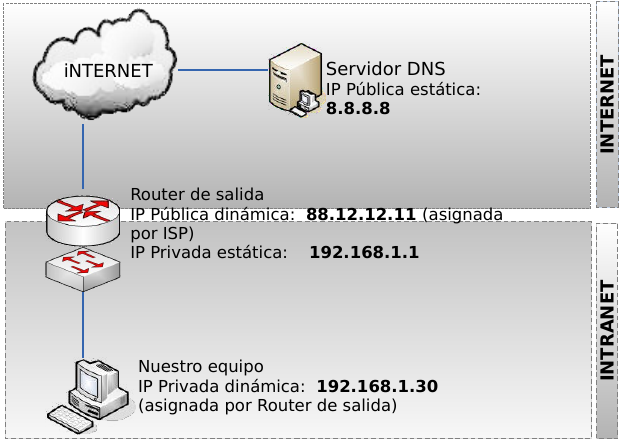
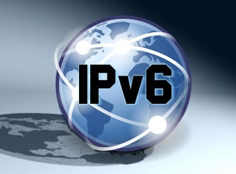

Configuración de clientes
--------------------------

Supongamos que deseamos configurar el soporte de red para el equipo que viene en el siguiente esquema. Para ello debemos de establecer los siguientes parámetros:

- Dirección IP
- Máscara de red
- **Puerta de enlace**
- Servidores de resolución de nombres (DNS)

Normalmente estos parámetros son configurados dinámicamente mediante DHCP por el Router de salida.

No obstante también es posible su configuración de forma manual.

   Esquema de referencia

Enrutamiento en el cliente
++++++++++++++++++++++++++

Un parámetro de importancia capital en una intranet es la configuración de la ruta por defecto en los clientes, que les permitirá salir a Internet. Para cada cliente deberemos establecer una **puerta de enlace o gateway** que es la dirección IP por la que el tráfico de red puede acceder a Internet. En el ejemplo anterior esta IP es **192.168.1.1**.

Dicha IP suele ser la IP interna (a menudo privada) del router. Dicha dirección y la dirección de todos los equipos clientes deben hallarse dentro de la misma red (en este caso 192.168.1.0)

Si la puerta de enlace no se halla configurada o está incorrectamente configurada en los clientes, es imposible que los equipos puedan comunicarse con Internet.

A continuación mostramos como configurar, en el cliente, la puerta de enlace haciendo uso del terminal de texto. Tanto en Windows como en Linux se hace uso del comando **route** (aunque su sintaxis es ligeramente diferente en cada caso).

**Ver puerta de enlace configurada**

.. code-block:: console

   route print

.. code-block:: console

   route

**Borrar o añadir puerta de enlace**

.. code-block:: console

   route delete 0.0.0.0 mask 0.0.0.0 192.168.1.1
   route add    0.0.0.0 mask 0.0.0.0 192.168.1.1

.. code-block:: console

   route del default gw 192.168.1.1
   route add default gw 192.168.1.1

Configuración del soporte básico de red
+++++++++++++++++++++++++++++++++++++++

**Visualización de configuración actual**

Podemos ver los parámetros de la red con los siguientes comandos:

.. code-block:: console

   ipconfig /all            # (IP/Máscara, Puerta de enlace, DNS)    

.. code-block:: console

   ifconfig                 # (IP/Máscara)
   route                    # (Puerta de enlace)
   cat /etc/resolv.conf     # (DNS)    

**Configuración dinámica de IP/Máscara, Puerta de Enlace y servidores DNS**

.. code-block:: console

   ipconfig /release        # (Liberamos)           
   ipconfig /renew          # (Renovamos)

.. code-block:: console

   dhclient -r eth0         # (Liberamos)
   dhclient eth0            # (Renovamos)   

**Configuración estática de IP/Máscara, Puerta de Enlace y servidores DNS**

.. code-block:: console

   netsh
   interface
   ip

   set address “Conexión de área local” static   \     
           192.168.1.30                          \
           255.255.255.0                         \
           192.168.1.1                           \ 
           1                                      

   set dns “Conexión de área local” static       \
           8.8.8.8                            

   commit
   exit

.. code-block:: console

   ifconfig  eth0  192.168.1.30  netmask  255.255.255.0 
   route  add  default  gw  192.168.1.1
   echo  "nameserver  8.8.8.8"  >>  /etc/resolv.conf

Comprobación básica (Windows y Linux)
+++++++++++++++++++++++++++++++++++++

Una vez configurado el soporte de red procederemos a comprobar su correcto funcionamiento. Para ello deben seguirse los siguientes pasos en el orden indicado. Si alguno de los pasos falla, deberemos de corregir el error antes de proseguir.

1. Comprobamos la pila TCP/IP del Sistema Operativo

        ``ping 127.0.0.1``  

2. Comprobamos la tarjeta de red

        ``ping 192.168.1.30``

3. Comprobamos las tablas de rutas

        ``route print``        (Windows) 
        ``route``              (Linux) 

4. Comprobamos el cable

        ``ping 192.168.1.1`` 

5. Comprobamos la salida a Internet

        ``ping 8.8.8.8``

6. Comprobamos la resolución de nombres

        ``ping www.google.es`` 

Utilidades de red (Windows y Linux)
+++++++++++++++++++++++++++++++++++

Para examinar equipos de la red

- ettercap

Para examinar puertos abiertos de nuestro equipo

- netstat

Para examinar puertos abiertos de otros equipos

- nmap

Para examinar tráfico en una red de difusión

- wireshark

IPv6
------

Diseñado por Steve Deering de Xerox PARC y Craig Mudge, IPv6 está destinado a sustituir al estándar IPv4, cuyo límite en el número de direcciones de red admisibles está empezando a restringir el crecimiento de Internet y su uso, especialmente en China, India, y otros países asiáticos densamente poblados. Pero el nuevo estándar mejorará el servicio globalmente; por ejemplo, proporcionando a futuras celdas telefónicas y dispositivos móviles con sus direcciones propias y permanentes. Al día de hoy se calcula que las dos terceras partes de las direcciones que ofrece IPv4 ya están asignadas.

IPv4 soporta 4.294.967.296 (2\ :sup:`32`) direcciones de red diferentes, un número inadecuado para dar una dirección a cada persona del planeta, y mucho menos para cada coche, teléfono, PDA o tostadora; mientras que **IPv6** soporta 340.282.366.920.938.463.463.374.607.431.768.211.456 (2\ :sup:`128` ó 340 sextillones) direcciones —cerca de 4,3 × 10\ :sup:`20` (430 trillones) direcciones por cada pulgada cuadrada (6,7 × 10\ :sup:`17` ó 670 mil billones direcciones/mm\ :sup:`2`) de la superficie de La Tierra.

Adoptado por el **Internet Engineering Task Force (IETF)** en 1994 (cuando era llamado "IP Next Generation" o IPng), IPv6 cuenta con un pequeño porcentaje de las direcciones públicas de Internet, que todavía están dominadas por IPv4. La adopción de IPv6 ha sido frenada por la traducción de direcciones de red (NAT), que alivia parcialmente el problema de la falta de direcciones IP. Pero NAT hace difícil o imposible el uso de algunas aplicaciones P2P, como son la voz sobre IP (VoIP) y juegos multiusuario. Además, NAT rompe con la idea originaria de Internet donde todos pueden conectarse con todos. Actualmente, el gran catalizador de IPv6 es la capacidad de ofrecer nuevos servicios, como la movilidad, Calidad de Servicio (QoS), privacidad, etc. El gobierno de los Estados Unidos ha ordenado el despliegue de IPv6 por todas sus agencias federales para el año 2008.

Se espera que IPv4 se siga soportando hasta por lo menos el 2025, dado que hay muchos dispositivos heredados que no se migrarán a IPv6 nunca y que seguirán siendo utilizados por mucho tiempo.

IPv6 es la segunda versión del Protocolo de Internet que se ha adoptado para uso general. También hubo un IPv5, pero no fue un sucesor de IPv4; mejor dicho, fue un protocolo experimental orientado al flujo de streaming que intentaba soportar voz, video y audio.

Direccionamiento IPv6
++++++++++++++++++++++

El cambio más drástico de IPv4 a IPv6 es la longitud de las direcciones de red. Las direcciones IPv6, definidas en el RFC 2373 y RFC 2374, son de **128 bits**; esto corresponde a 32 dígitos hexadecimales, que se utilizan normalmente para escribir las direcciones IPv6, como se describe en la siguiente sección.

El número de direcciones IPv6 posibles es de 2\ :sup:`128` ≈ 3.4 x 10\ :sup:`38`. Este número puede también representarse como 1632, con 32 dígitos hexadecimales, cada uno de los cuales puede tomar 16 valores (véase combinatoria).

En muchas ocasiones las direcciones IPv6 están compuestas por dos partes lógicas: un prefijo de 64 bits y otra parte de 64 bits que corresponde al identificador de interfaz, que casi siempre se genera automáticamente a partir de la dirección MAC de la interfaz a la que está asignada la dirección.

Notación para las direcciones IPv6
++++++++++++++++++++++++++++++++++

Las direcciones IPv6, de 128 bits de longitud, se escriben como ocho grupos de cuatro dígitos hexadecimales.

Por ejemplo,

``2001:0db8:85a3:08d3:1319:8a2e:0370:7334``

es una dirección IPv6 válida.

Si un grupo de cuatro dígitos es nulo (es decir, toma el valor "0000"), puede ser comprimido. Por ejemplo,

``2001:0db8:85a3:0000:1319:8a2e:0370:7344``  

es la misma dirección que

``2001:0db8:85a3::1319:8a2e:0370:7344``

Siguiendo esta regla, si más de dos grupos consecutivos son nulos, pueden comprimirse como ``::``. Si la dirección tiene más de una serie de grupos nulos consecutivos la compresión solo en uno de ellos. Así,

- ``2001:0DB8:0000:0000:0000:0000:1428:57ab``
- ``2001:0DB8:0000:0000:0000::1428:57ab``
- ``2001:0DB8:0:0:0:0:1428:57ab``   
- ``2001:0DB8:0::0:1428:57ab``
- ``2001:0DB8::1428:57ab``

son todas válidas y significan lo mismo, pero

``2001::25de::cade``

es inválido porque no queda claro cuantos grupos nulos hay en cada lado.

Los ceros iniciales en un grupo pueden ser omitidos. Así,

``2001:0DB8:02de::0e13``

es lo mismo que

``2001:DB8:2de::e13`` 

Si la dirección es una dirección IPv4 camuflada, los últimos 32 bits pueden escribirse en base decimal; así,

``::ffff:192.168.89.9``

es lo mismo que  

``::ffff:c0a8:5909``

pero no lo mismo que 

- ``::192.168.89.9`` 
- ``::c0a8:5909`` 

El formato ``::ffff:1.2.3.4`` se denomina dirección **IPv4 mapeada**, y el formato ``::1.2.3.4`` dirección **IPv4 compatible**.

Las direcciones IPv4 pueden ser transformadas fácilmente al formato IPv6. Por ejemplo, si la dirección decimal IPv4 es ``135.75.43.52`` (en hexadecimal, ``0x874B2B34``), puede ser convertida a ``0000:0000:0000:0000:0000:0000:874B:2B34`` o ``::874B:2B34``. Entonces, uno puede usar la notación mixta dirección IPv4 compatible, en cuyo caso la dirección debería ser ``::135.75.43.52``. Este tipo de dirección IPv4 compatible casi no está siendo utilizada en la práctica, aunque los estándares no la han declarado obsoleta.

Tipos de direcciones
+++++++++++++++++++++

IPv6 tiene tres tipos de direcciones, que se pueden clasificar según el tipo y alcance:

- Las direcciones **UNICAST**. Se envía un paquete a una interfaz.
- Las direcciones **MULTICAST** (multidifusión). Se envía un paquete de múltiples interfaces.
- Las direcciones **ANYCAST**. Se envía un paquete a la más cercana de múltiples interfaces (en términos de distancia de enrutamiento).

**No hay direcciones de broadcast en IPv6**. Las direcciones de multidifusión han reemplazado esta función.

Las direcciones Unicast y Anycast en IPv6 tienen los siguientes ámbitos (para las direcciones multicast, el ámbito está integrado en la estructura de dirección):

- De enlace local. El ámbito es el enlace local (nodos de la misma subred).
- Global. El alcance es global (direcciones de Internet IPv6).

Además, IPv6 tiene direcciones especiales como la dirección de bucle invertido. El ámbito de una dirección especial depende del tipo de dirección especial.

Gran parte del espacio de direcciones IPv6 está sin asignar.

**Tabla muy resumida de la asignación por tipo de dirección**.

=============================== ========================= ====================
Tipo de dirección               Prefijo binario           Notación IPv6
=============================== ========================= ====================
Sin especificar                 00 . . . 0 (128 bits)     ::/128
Loopback                        00 . . . 1 (128 bits)     ::1/128
Multicast                       11111111 . . .            FF00::/8
Link-local unicast              1111111010 . . .          FE80::/10
Site-local unicast (obsoleto)   1111111011 . . .          FEC0::/10
Local unicast                   1111110 . . .             FC00::/7
Global unicast                  001 . . .                 2000::/3
=============================== ========================= ====================

