Configuración de clientes
--------------------------

Supongamos que deseamos configurar el soporte de red para el equipo que viene en el siguiente esquema. Para ello debemos de establecer los siguientes parámetros:

- Dirección IP
- Máscara de red
- **Puerta de enlace**
- Servidores de resolución de nombres (DNS)

Normalmente estos parámetros son configurados dinámicamente mediante DHCP por el Router de salida.

No obstante también es posible su configuración de forma manual.

.. figure:: images/tema08-011.png

   Esquema de referencia

Enrutamiento en el cliente
++++++++++++++++++++++++++

Un parámetro de importancia capital en una intranet es la configuración de la ruta por defecto en los clientes, que les permitirá salir a Internet. Para cada cliente deberemos establecer una **puerta de enlace o gateway** que es la dirección IP por la que el tráfico de red puede acceder a Internet. En el ejemplo anterior esta IP es **192.168.1.1**.

Dicha IP suele ser la IP interna (a menudo privada) del router. Dicha dirección y la dirección de todos los equipos clientes deben hallarse dentro de la misma red (en este caso 192.168.1.0)

Si la puerta de enlace no se halla configurada o está incorrectamente configurada en los clientes, es imposible que los equipos puedan comunicarse con Internet.

A continuación mostramos como configurar, en el cliente, la puerta de enlace haciendo uso del terminal de texto. Tanto en Windows como en Linux se hace uso del comando **route** (aunque su sintaxis es ligeramente diferente en cada caso).

**Ver puerta de enlace configurada**

.. image:: images/tema08-windows-logo.png
   :align: left

.. code-block:: console

   route print

.. image:: images/tema08-linux-logo.png
   :align: left

.. code-block:: console

   route

**Borrar o añadir puerta de enlace**

.. image:: images/tema08-windows-logo.png
   :align: left

.. code-block:: console

   route delete 0.0.0.0 mask 0.0.0.0 192.168.1.1
   route add    0.0.0.0 mask 0.0.0.0 192.168.1.1

.. image:: images/tema08-linux-logo.png
   :align: left

.. code-block:: console

   route del default gw 192.168.1.1
   route add default gw 192.168.1.1

Configuración del soporte básico de red
+++++++++++++++++++++++++++++++++++++++

**Visualización de configuración actual**

Podemos ver los parámetros de la red con los siguientes comandos:

.. image:: images/tema08-windows-logo.png
   :align: left

.. code-block:: console

   ipconfig /all            # (IP/Máscara, Puerta de enlace, DNS)    

.. image:: images/tema08-linux-logo.png
   :align: left

.. code-block:: console

   ifconfig                 # (IP/Máscara)
   route                    # (Puerta de enlace)
   cat /etc/resolv.conf     # (DNS)    

**Configuración dinámica de IP/Máscara, Puerta de Enlace y servidores DNS**

.. image:: images/tema08-windows-logo.png
   :align: left

.. code-block:: console

   ipconfig /release        # (Liberamos)           
   ipconfig /renew          # (Renovamos)

.. image:: images/tema08-linux-logo.png
   :align: left

.. code-block:: console

   dhclient -r eth0         # (Liberamos)
   dhclient eth0            # (Renovamos)   

**Configuración estática de IP/Máscara, Puerta de Enlace y servidores DNS**

.. image:: images/tema08-windows-logo.png
   :align: left

.. code-block:: console

   netsh
   interface
   ip

   set address “Conexión de área local” static   \     
           192.168.1.30                          \
           255.255.255.0                         \
           192.168.1.1                           \ 
           1                                      

   set dns “Conexión de área local” static       \
           8.8.8.8                            

   commit
   exit

.. image:: images/tema08-linux-logo.png
   :align: left

.. code-block:: console

   ifconfig  eth0  192.168.1.30  netmask  255.255.255.0 
   route  add  default  gw  192.168.1.1
   echo  "nameserver  8.8.8.8"  >>  /etc/resolv.conf

Comprobación básica (Windows y Linux)
+++++++++++++++++++++++++++++++++++++

Una vez configurado el soporte de red procederemos a comprobar su correcto funcionamiento. Para ello deben seguirse los siguientes pasos en el orden indicado. Si alguno de los pasos falla, deberemos de corregir el error antes de proseguir.

1. Comprobamos la pila TCP/IP del Sistema Operativo

        ``ping 127.0.0.1``  

2. Comprobamos la tarjeta de red

        ``ping 192.168.1.30``

3. Comprobamos las tablas de rutas

        ``route print``        (Windows) 
        ``route``              (Linux) 

4. Comprobamos el cable

        ``ping 192.168.1.1`` 

5. Comprobamos la salida a Internet

        ``ping 8.8.8.8``

6. Comprobamos la resolución de nombres

        ``ping www.google.es`` 

Utilidades de red (Windows y Linux)
+++++++++++++++++++++++++++++++++++

Para examinar equipos de la red

- ettercap

Para examinar puertos abiertos de nuestro equipo

- netstat

Para examinar puertos abiertos de otros equipos

- nmap

Para examinar tráfico en una red de difusión

- wireshark

Estándares
===========

Protocolo IP
-------------

IP es el principal protocolo de la capa de red. Este protocolo define la unidad básica de transferencia de datos entre el origen y el destino, atravesando toda la red de redes. Además, el software IP es el encargado de elegir la ruta más adecuada por la que los datos serán enviados. Se trata de un sistema de entrega de paquetes (llamados **datagramas IP**) que tiene las siguientes características:

- Es **no orientado a conexión** debido a que cada uno de los paquetes puede seguir rutas distintas entre el origen y el destino. Entonces pueden llegar duplicados o desordenados.
- Es **no fiable** porque los paquetes pueden perderse, dañarse o llegar retrasados.

.. note::
  
   El protocolo IP está definido en la RFC 791

Formato del datagrama IP
+++++++++++++++++++++++++

El datagrama IP es la unidad básica de transferencia de datos entre el origen y el destino. Viaja en el campo de datos de las tramas físicas (recuérdese la trama Ethernet) de las distintas redes que va atravesando. Cada vez que un datagrama tiene que atravesar un router, el datagrama saldrá de la trama física de la red que abandona y se acomodará en el campo de datos de una trama física de la siguiente red. Este mecanismo permite que un mismo datagrama IP pueda atravesar redes distintas: enlaces punto a punto, redes ATM, redes Ethernet, redes Token Ring, etc. El propio datagrama IP tiene también un campo de datos: será aquí donde viajen los paquetes de las capas superiores.

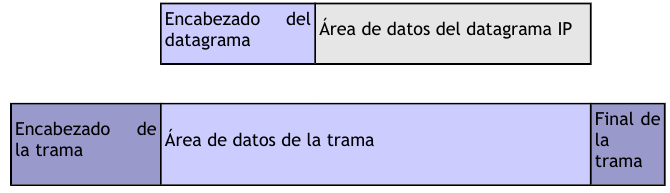

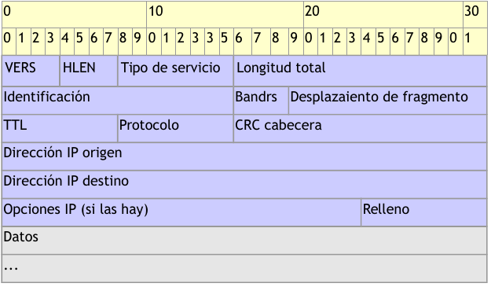

**Campos del datagrama IP**

- **VERS (4 bits)**. Indica la versión del protocolo IP que se utilizó para crear el datagrama. Actualmente se utiliza la versión 4 (IPv4) aunque ya se están preparando las especificaciones de la siguiente versión, la 6 (IPv6).

- **HLEN (4 bits)**. Longitud de la cabecera expresada en múltiplos de 32 bits. El valor mínimo es 5, correspondiente a 160 bits = 20 bytes.

- **Tipo de servicio (Type Of Service)**. Los 8 bits de este campo se dividen a su vez en:

  - **Prioridad (3 bits)**. Un valor de 0 indica baja prioridad y un valor de 7, prioridad máxima.
    
  - Los siguientes tres bits indican cómo se prefiere que se transmita el mensaje, es decir, son sugerencias a los encaminadores que se encuentren a su paso los cuales pueden tenerlas en cuenta o no.

    - **Bit D** (Delay). Solicita retardos cortos (enviar rápido).
    - **Bit T** (Throughput). Solicita un alto rendimiento (enviar mucho en el menor tiempo posible).
    - **Bit R** (Reliability). Solicita que se minimice la probabilidad de que el datagrama se pierda o resulte dañado (enviar bien).

  - Los siguiente dos bits no tienen uso.

- **Longitud total (16 bits)**. Indica la longitud total del datagrama expresada en bytes. Como el campo tiene 16 bits, la máxima longitud posible de un datagrama será de 65535 bytes.

- ** Identificación (16 bits)**. Número de secuencia que junto a la dirección origen, dirección destino y el protocolo utilizado identifica de manera única un datagrama en toda la red. Si se trata de un datagrama fragmentado, llevará la misma identificación que el resto de fragmentos.

- **Banderas o indicadores (3 bits)**. Sólo 2 bits de los 3 bits disponibles están actualmente utilizados. El bit de Más fragmentos (MF) indica que no es el último datagrama. Y el bit de No fragmentar (NF) prohíbe la fragmentación del datagrama. Si este bit está activado y en una determinada red se requiere fragmentar el datagrama, éste no se podrá transmitir y se descartará.

- **Desplazamiento de fragmentación (13 bits)**. Indica el lugar en el cual se insertará el fragmento actual dentro del datagrama completo, medido en unidades de 64 bits. Por esta razón los campos de datos de todos los fragmentos menos el último tienen una longitud múltiplo de 64 bits. Si el paquete no está fragmentado, este campo tiene el valor de cero.

- **Tiempo de vida o TTL (8 bits)**. Número máximo de segundos que puede estar un datagrama en la red de redes. Cada vez que el datagrama atraviesa un router se resta 1 a este número. Cuando llegue a cero, el datagrama se descarta  y se devuelve un mensaje ICMP de tipo "tiempo excedido" para informar al origen de la incidencia.

- **Protocolo (8 bits)**. Indica el protocolo utilizado en el campo de datos: 1 para ICMP, 2 para IGMP, 6 para TCP y 17 para UDP.

- **CRC cabecera (16 bits)**. Contiene la suma de comprobación de errores sólo para la cabecera del datagrama. La verificación de errores de los datos corresponde a las capas superiores.

- **Dirección origen (32 bits)**. Contiene la dirección IP del origen.

- **Dirección destino (32 bits)**. Contiene la dirección IP del destino.

- **Opciones IP**. Este campo no es obligatorio y especifica las distintas opciones solicitadas por el usuario que envía los datos (generalmente para pruebas de red y depuración).

- **Relleno**. Si las opciones IP (en caso de existir) no ocupan un múltiplo de 32 bits, se completa con bits adicionales hasta alcanzar el siguiente múltiplo de 32 bits (recuérdese que la longitud de la cabecera tiene que ser múltiplo de 32 bits).

Fragmentación
+++++++++++++

Ya hemos visto que las tramas físicas tienen un campo de datos y que es aquí donde se transportan los datagramas IP. Sin embargo, este campo de datos no puede tener una longitud indefinida debido a que está limitado por el diseño de la red. **El MTU de una red es la mayor cantidad de datos que puede transportar su trama física**. El MTU de las redes Ethernet es 1500 bytes y el de las redes Token-Ring, 8192 bytes. Esto significa que una red Ethernet nunca podrá transportar un datagrama de más de 1500 bytes sin fragmentarlo.

Un encaminador (router) fragmenta un datagrama en varios si el siguiente tramo de la red por el que tiene que viajar el datagrama tiene un MTU inferior a la longitud del datagrama. Veamos con el siguiente ejemplo cómo se produce la fragmentación de un datagrama.

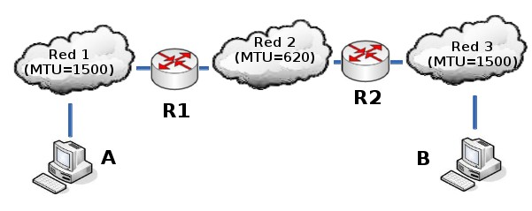

Supongamos que el host A envía un datagrama de 1400 bytes de datos (1420 bytes en total) al host B. El datagrama no tiene ningún problema en atravesar la red 1 ya que 1420 < 1500. Sin embargo, no es capaz de atravesar la red 2 (1420 >= 620). El router R1 fragmenta el datagrama en el menor número de fragmentos posibles que sean capaces de atravesar la red 2. Cada uno de estos fragmentos es un nuevo datagrama con la misma Identificación pero distinta información en el campo de Desplazamiento de fragmentación y el bit de Más fragmentos (MF). Veamos el resultado de la fragmentación:

**Fragmento 1**: Long. total = 620 bytes; Desp = 0; MF=1 (contiene los primeros 600 bytes de los datos del datagrama original)

**Fragmento 2**: Long. total = 620 bytes; Desp = 600; MF=1 (contiene los siguientes 600 bytes de los datos del datagrama original)

**Fragmento 3**: Long. total = 220 bytes; Desp = 1200; MF=0 (contiene los últimos 200 bytes de los datos del datagrama original)

El router R2 recibirá los 3 datagramas IP (fragmentos) y los enviará a la red 3 sin reensamblarlos. Cuando el host B reciba los fragmentos, recompondrá el datagrama original. Los encaminadores intermedios no reensamblan los fragmentos debido a que esto supondría una carga de trabajo adicional, a parte de memorias temporales. Nótese que el ordenador destino puede recibir los fragmentos cambiados de orden pero esto no supondrá ningún problema para el reensamblado del datagrama original puesto que cada fragmento guarda suficiente información.

Si el datagrama del ejemplo hubiera tenido su bit No fragmentar (NF) a 1, no hubiera conseguido atravesar el router R1 y, por tanto, no tendría forma de llegar hasta el host B. El encaminador R1 descartaría el datagrama.

CIDR ( Classless Inter-Domain Routing)
++++++++++++++++++++++++++++++++++++++

**Encaminamiento Inter-Dominios sin Clases**

Pronunciado como "cider" or "cedar", se introdujo en 1993 y representa la última mejora en el modo como se interpretan las direcciones IP. Su introducción permitió una mayor flexibilidad al dividir rangos de direcciones IP en redes separadas. De esta manera permitió:

Un uso más eficiente de las cada vez más escasas direcciones IPv4.
Un mayor uso de la jerarquía de direcciones ('agregación de prefijos de red'), disminuyendo la sobrecarga de los enrutadores principales de Internet para realizar el encaminamiento.
Los bloques CIDR IPv4 se identifican usando una sintaxis similar a la de las direcciones IPv4: cuatro números decimales separados por puntos, seguidos de una barra de división y un número de 0 a 32; **A.B.C.D/N**. El número tras la barra es la **longitud de prefijo**, contando desde la izquierda, y representa el número de bits comunes a todas las direcciones incluidas en el bloque CIDR.

Decimos que una dirección IP está incluida en un bloque CIDR, y que encaja con el prefijo CIDR, si los N bits iniciales de la dirección y el prefijo son iguales. Por tanto, para entender CIDR es necesario visualizar la dirección IP en binario. Dado que la longitud de una dirección IPv4 es fija, de 32 bits, un prefijo CIDR de N-bits deja 32 − N bits sin encajar, y hay 2\ :sup:`(32 − N)` combinaciones posibles con los bits restantes. Esto quiere decir que 2\ :sup:`(32 − N)` direcciones IPv4 encajan en un prefijo CIDR de N-bits.

Nótese que los prefijos **CIDR cortos** (números cercanos a 0) permiten encajar un mayor número de direcciones IP, mientras que prefijos **CIDR largos** (números cercanos a 32) permiten encajar menos direcciones IP. CIDR también se usa con direcciones IPv6, en las que la longitud del prefijo varia desde 0 a 128, debido a la mayor longitud de bit en las direcciones, con respecto a IPv4. En el caso de IPv6 se usa una sintaxis similar a la comentada: el prefijo se escribe como una dirección IPv6, seguida de una barra y el número de bits significativos.

**CIDR usa máscaras de subred de longitud variable (VLSM)** para asignar direcciones IP a subredes de acuerdo a las necesidades de cada subred. De esta forma, la división red/host puede ocurrir en cualquier bit de los 32 que componen la dirección IP. Este proceso puede ser recursivo, dividiendo una parte del espacio de direcciones en porciones cada vez menores, usando máscaras que cubren un mayor número de bits.

Las direcciones de red CIDR/VLSM se usan a lo largo y ancho de la Internet pública, y en muchas grandes redes privadas. El usuario normal no ve este uso puesto en práctica, al estar en una red en la que se usarán, por lo general, direcciones de red privadas recogidas en el RFC 1918. El término VLSM (**Variable Lenght Subnet Mask - Máscara de Subred de Longitud Variable**) se usa generalmente cuando se habla de redes privadas, mientras que CIDR se usa cuando se habla de Internet (red pública).

Tabla de conversión de prefijos CIDR
+++++++++++++++++++++++++++++++++++++

======= ========================= ================ ===============
CIDR    Clase                     Hosts [1]_       Máscara
======= ========================= ================ ===============
/32     1/256 C                   1                255.255.255.255
/31     1/128 C                   2                255.255.255.254
/30     1/64 C                    4                255.255.255.252
/29     1/32 C                    8                255.255.255.248
/28     1/16 C                    16               255.255.255.240
/27     1/8 C                     32               255.255.255.224
/26     1/4 C                     64               255.255.255.192
/25     1/2 C                     128              255.255.255.128
/24     1 C                       256              255.255.255.000 
/23     2 C                       512              255.255.254.000
/22     4 C                       1024             255.255.252.000
/21     8 C                       2048             255.255.248.000
/20     16 C                      4096             255.255.240.000
/19     32 C                      8192             255.255.224.000
/18     64 C                      16384            255.255.192.000
/17     128 C                     32768            255.255.128.000
/16     256 C, 1 B                65536            255.255.000.000
/15     512 C, 2 B                131072           255.254.000.000
/14     1024 C, 4 B               262144           255.252.000.000
/13     2048 C, 8 B               524288           255.248.000.000
/12     4096 C, 16 B              1048576          255.240.000.000
/11     8192 C, 32 B              2097152          255.224.000.000
/10     16384 C, 64 B             4194304          255.192.000.000
/9      32768 C, 128B             8388608          255.128.000.000
/8      65536 C, 256B, 1 A        16777216         255.000.000.000
/7      131072 C, 512B, 2 A       33554432         254.000.000.000
/6      262144 C, 1024 B, 4 A     67108864         252.000.000.000
/5      524288 C, 2048 B, 8 A     134217728        248.000.000.000
/4      1048576 C, 4096 B, 16 A   268435456        240.000.000.000
/3      2097152 C, 8192 B, 32 A   536870912        224.000.000.000
/2      4194304 C, 16384 B, 64 A  1073741824       192.000.000.000
/1      8388608 C, 32768 B, 128 A 2147483648       128.000.000.000
======= ========================= ================ ===============

.. [1] En la práctica hay que restar 2 a este número. La dirección menor (más baja - todos los bits de host a 0) del bloque se usa para identificar a la propia red (toda la red), y la dirección mayor (la más alta - todos los bits de host a 1) se usa como dirección de broadcast. Por tanto, en un bloque CIDR /24 podríamos disponer de 2\ :sup:`8` − 2 = 254 direcciones IP para asignar a dispositivos.

Otro beneficio de CIDR es la posibilidad de **agregar prefijos de encaminamiento**, un proceso conocido como "**supernetting**". Una dirección IP puede encajar en varios prefijos CIDR de longitudes diferentes. Por ejemplo, dieciséis redes /24 contíguas pueden ser agregadas y publicadas en los enrutadores de Internet como una sola ruta /20 (si los primeros 20 bits de sus respectivas redes coinciden). Dos redes /20 contiguas pueden ser agregadas en una /19, etc...

Esto permite una reducción significativa en el número de rutas que los enrutadores en Internet tienen que conocer (y una reducción de memoria, recursos, etc...) y previene una explosión de tablas de encaminamiento, que podría sobrecargar a los routers e impedir la expansión de Internet en el futuro.

Superredes
+++++++++++

Para muchas organizaciones una dirección de red de clase C es poco.

Solución: Agrupar direcciones consecutivas (tienen un prefijo común) de redes de clase C para asignarlas a una organización.

Esto permite asignar espacio de direcciones a organizaciones con redes de tamaño medio, evitando utilizar direcciones de clase B.

Ejemplo de agrupamiento:

.. code-block:: none

	193.40.128.0 = 11000001 00101000 1000 0000 00000000
	193.40.129.0 = 11000001 00101000 1000 0001 00000000
	.
	.
	.                                   
	193.40.142.0 = 11000001 00101000 1000 1110 00000000
	193.40.143.0 = 11000001 00101000 1000 1111 00000000

La dirección de red/máscara sería 193.40.128.0/20 ( 255.255.240.0)

.. code-block:: none

	Máscara en binario: 11111111  11111111  11110000  00000000.     

Existen 2\ :sup:`12`-2 (4096-2) direcciones IP para hosts

Protocolo ARP
--------------

Dentro de una misma red, las máquinas se comunican enviándose tramas físicas. Las tramas Ethernet contienen campos para las direcciones físicas de origen y destino (6 bytes cada una):

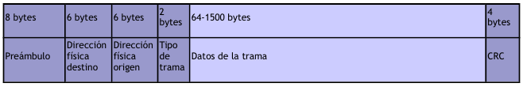

8 bytes	6 bytes	6 bytes	2 bytes	64-1500 bytes	4 bytes
Preámbulo	Dirección físicadestino	Dirección físicaorigen	Tipo de trama	Datos de la trama	CRC
El problema que se nos plantea es cómo podemos conocer la dirección física de la máquina destino. El único dato que se indica en los datagramas es la dirección IP de destino. ¿Cómo se pueden entregar entonces estos datagramas? Necesitamos obtener la dirección física de un ordenador a partir de su dirección IP. Esta es justamente la misión del protocolo ARP (Address Resolution Protocol, protocolo de resolución de direcciones).

.. note:: 

   ARP se utiliza en **redes con mecanismos de difusión** (Ethernet, FDDI, Token-Ring, etc.)
   El protocolo ARP está definido en RFC 826, RFC 1042 y RFC 1390

Vamos a retomar el ejemplo introductorio de este Capítulo. El host A envía un datagrama con origen 192.168.0.10 y destino 10.10.0.7 (B). Como el host B se encuentra en una red distinta al host A, el datagrama tiene que atravesar el router 192.168.0.1 (R1). Se necesita conocer la dirección física de R1.

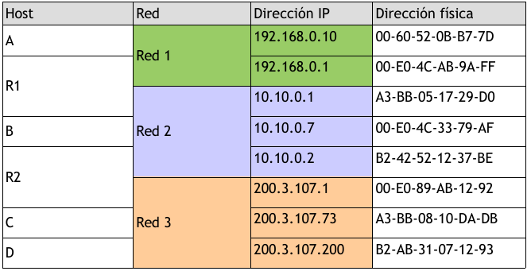

Es entonces cuando entra en funcionamiento el protocolo ARP: A envía un mensaje ARP a todas las máquinas de su red preguntando "¿Cuál es la dirección física de la máquina con dirección IP 192.168.0.1?". La máquina con dirección 192.168.0.1 (R1) advierte que la pregunta está dirigida a ella y responde a A con su dirección física (00-E0-4C-AB-9A-FF). Entonces A envía una trama física con origen 00-60-52-0B-B7-7D y destino 00-E0-4C-AB-9A-FF conteniendo el datagrama (origen 192.168.0.10 y destino 10.10.0.7). Al otro lado del router R2 se repite de nuevo el proceso para conocer la dirección física de B y entregar finalmente el datagrama a B. El mismo datagrama ha viajado en dos tramas físicas distintas, una para la red 1 y otra para la red 2.

Observemos que las preguntas ARP son de difusión (se envían a todas las máquinas). Estas preguntas llevan además la dirección IP y dirección física de la máquina que pregunta. La respuesta se envía directamente a la máquina que formuló la pregunta.

Tabla ARP (caché ARP)
+++++++++++++++++++++++

Cada ordenador almacena una tabla de direcciones IP y direcciones físicas. Cada vez que formula una pregunta ARP y le responden, inserta una nueva entrada en su tabla. La primera vez que C envíe un mensaje a D tendrá que difundir previamente una pregunta ARP, tal como hemos visto. Sin embargo, las siguientes veces que C envíe mensajes a D ya no será necesario realizar nuevas preguntas puesto que C habrá almacenado en su tabla la dirección física de D. Sin embargo, para evitar incongruencias en la red debido a posibles cambios de direcciones IP o adaptadores de red, se asigna un tiempo de vida de cierto número de segundos a cada entrada de la tabla. Cuando se agote el tiempo de vida de una entrada, ésta será eliminada de la tabla.

Las tablas ARP reducen el tráfico de la red al evitar preguntas ARP innecesarias. Pensemos ahora en distintas maneras para mejorar el rendimiento de la red. Después de una pregunta ARP, el destino conoce las direcciones IP y física del origen. Por lo tanto, podría insertar la correspondiente entrada en su tabla. Pero no sólo eso, sino que todas las estaciones de la red escuchan la pregunta ARP: podrían insertar también las correspondientes entradas en sus tablas. Como es muy probable que otras máquinas se comuniquen en un futuro con la primera, habremos reducido así el tráfico de la red aumentando su rendimiento.

Esto que hemos explicado es para comunicar dos máquinas conectadas a la misma red. Si la otra máquina no estuviese conectada a la misma red, sería necesario atravesar uno o más routers hasta llegar al host destino. La máquina origen, si no la tiene en su tabla, formularía una pregunta ARP solicitando la dirección física del router y le transferiría a éste el mensaje. Estos pasos se van repitiendo para cada red hasta llegar a la máquina destino.

Protocolo ICMP
---------------

Debido a que el protocolo IP no es fiable, los datagramas pueden perderse o llegar defectuosos a su destino. El protocolo ICMP (Internet Control Message Protocol, protocolo de mensajes de control y error) se encarga de informar al origen si se ha producido algún error durante la entrega de su mensaje. Pero no sólo se encarga de notificar los errores, sino que también transporta distintos mensajes de control.

El protocolo ICMP únicamente informa de incidencias en la red pero no toma ninguna decisión. Esto será responsabilidad de las capas superiores. Los mensajes ICMP viajan en el campo de datos de un datagrama IP, como se puede apreciar en el siguiente esquema:

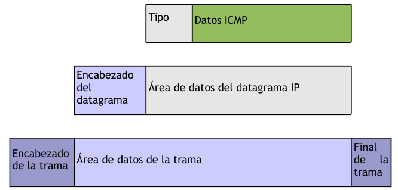

Debido a que el protocolo IP no es fiable puede darse el caso de que un mensaje ICMP se pierda o se dañe. Si esto llega a ocurrir no se creará un nuevo mensaje ICMP sino que el primero se descartará sin más.

Los mensajes ICMP comienzan con un campo de 8 bits que contiene el tipo de mensaje, según se muestra en la tabla siguiente. El resto de campos son distintos para cada tipo de mensaje ICMP.

.. note::

   El formato y significado de cada mensaje ICMP está documentado en la RFC 792

============== ===========================================================
Campo de tipo  Tipo de mensaje ICMP
============== ===========================================================
0              Respuesta de eco (Echo Reply)
3              Destino inaccesible (Destination Unreachable)
4              Disminución del tráfico desde el origen (Source Quench)
5              Redireccionar (cambio de ruta) (Redirect)
8              Solicitud de eco (Echo)
11             Tiempo excedido para un datagrama (Time Exceeded)
12             Problema de Parámetros (Parameter Problem)
13             Solicitud de marca de tiempo (Timestamp)
14             Respuesta de marca de tiempo (Timestamp Reply)
15             Solicitud de información (obsoleto) (Information Request)
16             Respuesta de información (obsoleto) (Information Reply)
17             Solicitud de máscara (Addressmask)
18             Respuesta de máscara (Addressmask Reply)
============== ===========================================================

Solicitud y respuesta de eco
++++++++++++++++++++++++++++

Los mensajes de solicitud y respuesta de eco, tipos 8 y 0 respectivamente, se utilizan para comprobar si existe comunicación entre 2 hosts a nivel de la capa de red. Estos mensajes comprueban que las capas física (cableado), acceso al medio (tarjetas de red) y red (configuración IP) están correctas. Sin embargo, no dicen nada de las capas de transporte y de aplicación las cuales podrían estar mal configuradas; por ejemplo, la recepción de mensajes de correo electrónico puede fallar aunque exista comunicación IP con el servidor de correo.

La orden **PING** envía mensajes de solicitud de eco a un host remoto e informa de las respuestas. Veamos su funcionamiento, en caso de no producirse incidencias en el camino.

1. A envía un mensaje ICMP de tipo 8 (Echo) a B
2. B recibe el mensaje y devuelve un mensaje ICMP de tipo 0 (Echo Reply) a A
3. A recibe el mensaje ICMP de B y muestra el resultado en pantalla

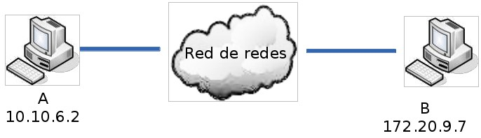

.. code-block:: none

	C:\>ping 172.20.9.7 -n 1
	Haciendo ping a 172.20.9.7 con 32 bytes de datos:
	Respuesta desde 172.20.9.7: bytes=32 tiempo<10ms TDV=128

En la orden anterior hemos utilizado el parámetro "-n 1" para que el host A únicamente envíe 1 mensaje de solicitud de eco. Si no se especifica este parámetro se enviarían 4 mensajes (y se recibirían 4 respuestas).

Si el host de destino no existiese o no estuviera correctamente configurado recibiríamos un mensaje ICMP de tipo 11 (Time Exceeded).

.. code-block:: none

	C:\>ping 192.168.0.6 -n 1
	Haciendo ping a 192.168.0.6 con 32 bytes de datos:
	Tiempo de espera agotado. 

Si tratamos de acceder a un host de una red distinta a la nuestra y no existe un camino para llegar hasta él, es decir, los routers no están correctamente configurados o estamos intentando acceder a una red aislada o inexistente, recibiríamos un mensaje ICMP de tipo 3 (Destination Unreachable).

.. code-block:: none

	C:\>ping 1.1.1.1 -n 1
	Haciendo ping a 1.1.1.1 con 32 bytes de datos:
	Respuesta desde 192.168.0.1: Host de destino inaccesible. 

Utilización de PING para diagnosticar errores en una red aislada
++++++++++++++++++++++++++++++++++++++++++++++++++++++++++++++++

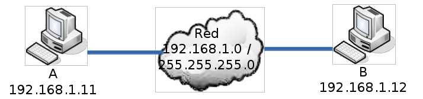

.. code-block:: none

	C:\>ping 192.168.1.12

- Respuesta. El cableado entre A y B, las tarjetas de red de A y B, y la configuración IP de A y B están correctos.
- Tiempo de espera agotado. Comprobar el host B y el cableado entre A y B.
- Host de destino inaccesible. Comprobar las direcciones IP y máscaras de subred de A y B porque no pertenecen a la misma red.
- Error. Probablemente estén mal instalados los protocolos TCP/IP del host A. Probar C:\>ping 127.0.0.1 para asegurarse.

.. note::

   El comando ping 127.0.0.1 informa de si están correctamente instalados los protocolos TCP/IP en nuestro host. No informa de si la tarjeta de red de nuestro host está correcta.

Utilización de PING para diagnosticar errores en una red de redes
++++++++++++++++++++++++++++++++++++++++++++++++++++++++++++++++++

A continuación veremos un ejemplo para una red de redes formada por dos redes (1 solo router). La idea es la misma para un mayor número de redes y routers.

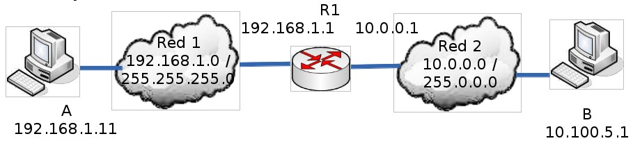

.. code-block:: none

	C:\>ping 10.100.5.1

- Respuesta. El cableado entre A y B, las tarjetas de red de A, R1 y B, y la configuración IP de A, R1 y B están correctos. El router R1 permite el tráfico de datagramas IP en los dos sentidos.
- Tiempo de espera agotado. Comprobar el host B y el cableado entre R1 y B. Para asegurarnos que el router R1 está funcionando correctamente haremos C:\>ping 192.168.1.1
- Host de destino inaccesible. Comprobar el router R1 y la configuración IP de A (probablemente la puerta de salida no sea 192.168.1.1). Recordemos que la puerta de salida (gateway) de una red es un host de su propia red que se utiliza para salir a otras redes.
- Error. Probablemente estén mal instalados los protocolos TCP/IP del host A. Probar C:\>ping 127.0.0.1 para asegurarse.

En el caso producirse errores de comunicación en una red de redes con más de un router (Internet es el mejor ejemplo), se suele utilizar el comando PING para ir diagnosticando los distintos routers desde el destino hasta el origen y descubrir así si el fallo es responsabilidad de la red de destino, de una red intermedia o de nuestra red.

.. note::
   
   Algunos hosts en Internet tienen deshabilitadas las respuestas de eco (mensajes ICMP tipo 0) como medida de seguridad. En estos casos hay que utilizar otros mecanismos para detectar si responde (por ejemplo, la apertura de conexión a un puerto)

Mensajes ICMP de tiempo excedido
++++++++++++++++++++++++++++++++

Los datagramas IP tienen un campo TTL (tiempo de vida) que impide que un mensaje esté dando vueltas indefinidamente por la red de redes. El número contenido en este campo disminuye en una unidad cada vez que el datagrama atraviesa un router. Cuando el TTL de un datagrama llega a 0, éste se descarta y se envía un mensaje ICMP de tipo 11 (Time Exceeded) para informar al origen.

Los mensajes ICMP de tipo 11 se pueden utilizar para hacer una traza del camino que siguen los datagramas hasta llegar a su destino. ¿Cómo? Enviando una secuencia de datagramas con TTL=1, TTL=2, TTL=3, TTL=4, etc... hasta alcanzar el host o superar el límite de saltos (30 si no se indica lo contrario). El primer datagrama caducará al atravesar el primer router y se devolverá un mensaje ICMP de tipo 11 informando al origen del router que descartó el datagrama. El segundo datagrama hará lo propio con el segundo router y así sucesivamente. Los mensajes ICMP recibidos permiten definir la traza.

La orden **TRACERT** (**traceroute** en entornos Unix) hace una traza a un determinado host. TRACERT funciona enviando mensajes ICMP de solicitud de eco con distintos TTL; traceroute, en cambio, envía mensajes UDP. Si la comunicación extremo a extremo no es posible, la traza nos indicará en qué punto se ha producido la incidencia. Existen algunas utilidades en Internet, como Visual Route, que conocen la localización geográfica de los principales routers de Internet. Esto permite dibujar en un mapamundi el recorrido que siguen los datagramas hasta llegar a un host.

.. code-block:: none

	C:\>tracert 130.206.1.2

	Traza a la dirección sun.rediris.es [130.206.1.2]
	sobre un máximo de 30 saltos:

	 1   1 ms   1 ms   1 ms PROXY [192.168.0.1]
	 2 122 ms 118 ms 128 ms MADR-X27.red.retevision.es [62.81.1.102]
	 3 143 ms 232 ms 147 ms MADR-R2.red.retevision.es [62.81.1.92]
	 4 130 ms 124 ms 246 ms MADR-R16.red.retevision.es [62.81.3.8]
	 5 590 ms 589 ms 431 ms MADR-R12.red.retevision.es [62.81.4.101]
	 6 612 ms 640 ms 124 ms MADR-R10.red.retevision.es [62.81.8.130]
	 7 259 ms 242 ms 309 ms 193.149.1.28
	 8 627 ms 752 ms 643 ms 213.0.251.42
	 9 137 ms 117 ms 118 ms 213.0.251.142
	10 109 ms 105 ms 110 ms A1-2-1.EB-Madrid00.red.rediris.es [130.206.224.81]
	11 137 ms 119 ms 122 ms A0-0-0-1.EB-Madrid3.red.rediris.es [130.206.224.86]
	12 109 ms 135 ms 115 ms sun.rediris.es [130.206.1.2]

	Traza completa. 

Ejemplo de Visual Route a una dirección IP de Taiwan (203.69.112.12):

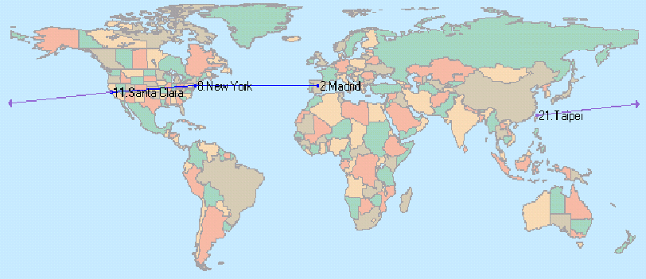

IPv6
------

.. figure:: images/tema08-047.png

Diseñado por Steve Deering de Xerox PARC y Craig Mudge, IPv6 está destinado a sustituir al estándar IPv4, cuyo límite en el número de direcciones de red admisibles está empezando a restringir el crecimiento de Internet y su uso, especialmente en China, India, y otros países asiáticos densamente poblados. Pero el nuevo estándar mejorará el servicio globalmente; por ejemplo, proporcionando a futuras celdas telefónicas y dispositivos móviles con sus direcciones propias y permanentes. Al día de hoy se calcula que las dos terceras partes de las direcciones que ofrece IPv4 ya están asignadas.

IPv4 soporta 4.294.967.296 (2\ :sup:`32`) direcciones de red diferentes, un número inadecuado para dar una dirección a cada persona del planeta, y mucho menos para cada coche, teléfono, PDA o tostadora; mientras que **IPv6** soporta 340.282.366.920.938.463.463.374.607.431.768.211.456 (2\ :sup:`128` ó 340 sextillones) direcciones —cerca de 4,3 × 10\ :sup:`20` (430 trillones) direcciones por cada pulgada cuadrada (6,7 × 10\ :sup:`17` ó 670 mil billones direcciones/mm\ :sup:`2`) de la superficie de La Tierra.

Adoptado por el **Internet Engineering Task Force (IETF)** en 1994 (cuando era llamado "IP Next Generation" o IPng), IPv6 cuenta con un pequeño porcentaje de las direcciones públicas de Internet, que todavía están dominadas por IPv4. La adopción de IPv6 ha sido frenada por la traducción de direcciones de red (NAT), que alivia parcialmente el problema de la falta de direcciones IP. Pero NAT hace difícil o imposible el uso de algunas aplicaciones P2P, como son la voz sobre IP (VoIP) y juegos multiusuario. Además, NAT rompe con la idea originaria de Internet donde todos pueden conectarse con todos. Actualmente, el gran catalizador de IPv6 es la capacidad de ofrecer nuevos servicios, como la movilidad, Calidad de Servicio (QoS), privacidad, etc. El gobierno de los Estados Unidos ha ordenado el despliegue de IPv6 por todas sus agencias federales para el año 2008.

Se espera que IPv4 se siga soportando hasta por lo menos el 2025, dado que hay muchos dispositivos heredados que no se migrarán a IPv6 nunca y que seguirán siendo utilizados por mucho tiempo.

IPv6 es la segunda versión del Protocolo de Internet que se ha adoptado para uso general. También hubo un IPv5, pero no fue un sucesor de IPv4; mejor dicho, fue un protocolo experimental orientado al flujo de streaming que intentaba soportar voz, video y audio.

Direccionamiento IPv6
++++++++++++++++++++++

El cambio más drástico de IPv4 a IPv6 es la longitud de las direcciones de red. Las direcciones IPv6, definidas en el RFC 2373 y RFC 2374, son de **128 bits**; esto corresponde a 32 dígitos hexadecimales, que se utilizan normalmente para escribir las direcciones IPv6, como se describe en la siguiente sección.

El número de direcciones IPv6 posibles es de 2\ :sup:`128` ≈ 3.4 x 10\ :sup:`38`. Este número puede también representarse como 1632, con 32 dígitos hexadecimales, cada uno de los cuales puede tomar 16 valores (véase combinatoria).

En muchas ocasiones las direcciones IPv6 están compuestas por dos partes lógicas: un prefijo de 64 bits y otra parte de 64 bits que corresponde al identificador de interfaz, que casi siempre se genera automáticamente a partir de la dirección MAC de la interfaz a la que está asignada la dirección.

Notación para las direcciones IPv6
++++++++++++++++++++++++++++++++++

Las direcciones IPv6, de 128 bits de longitud, se escriben como ocho grupos de cuatro dígitos hexadecimales.

Por ejemplo,

``2001:0db8:85a3:08d3:1319:8a2e:0370:7334``

es una dirección IPv6 válida.

Si un grupo de cuatro dígitos es nulo (es decir, toma el valor "0000"), puede ser comprimido. Por ejemplo,

``2001:0db8:85a3:0000:1319:8a2e:0370:7344``  

es la misma dirección que

``2001:0db8:85a3::1319:8a2e:0370:7344``

Siguiendo esta regla, si más de dos grupos consecutivos son nulos, pueden comprimirse como ``::``. Si la dirección tiene más de una serie de grupos nulos consecutivos la compresión solo en uno de ellos. Así,

- ``2001:0DB8:0000:0000:0000:0000:1428:57ab``
- ``2001:0DB8:0000:0000:0000::1428:57ab``
- ``2001:0DB8:0:0:0:0:1428:57ab``   
- ``2001:0DB8:0::0:1428:57ab``
- ``2001:0DB8::1428:57ab``

son todas válidas y significan lo mismo, pero

``2001::25de::cade``

es inválido porque no queda claro cuantos grupos nulos hay en cada lado.

Los ceros iniciales en un grupo pueden ser omitidos. Así,

``2001:0DB8:02de::0e13``

es lo mismo que

``2001:DB8:2de::e13`` 

Si la dirección es una dirección IPv4 camuflada, los últimos 32 bits pueden escribirse en base decimal; así,

``::ffff:192.168.89.9``

es lo mismo que  

``::ffff:c0a8:5909``

pero no lo mismo que 

- ``::192.168.89.9`` 
- ``::c0a8:5909`` 

El formato ``::ffff:1.2.3.4`` se denomina dirección **IPv4 mapeada**, y el formato ``::1.2.3.4`` dirección **IPv4 compatible**.

Las direcciones IPv4 pueden ser transformadas fácilmente al formato IPv6. Por ejemplo, si la dirección decimal IPv4 es ``135.75.43.52`` (en hexadecimal, ``0x874B2B34``), puede ser convertida a ``0000:0000:0000:0000:0000:0000:874B:2B34`` o ``::874B:2B34``. Entonces, uno puede usar la notación mixta dirección IPv4 compatible, en cuyo caso la dirección debería ser ``::135.75.43.52``. Este tipo de dirección IPv4 compatible casi no está siendo utilizada en la práctica, aunque los estándares no la han declarado obsoleta.

Tipos de direcciones
+++++++++++++++++++++

IPv6 tiene tres tipos de direcciones, que se pueden clasificar según el tipo y alcance:

- Las direcciones **UNICAST**. Se envía un paquete a una interfaz.
- Las direcciones **MULTICAST** (multidifusión). Se envía un paquete de múltiples interfaces.
- Las direcciones **ANYCAST**. Se envía un paquete a la más cercana de múltiples interfaces (en términos de distancia de enrutamiento).

**No hay direcciones de broadcast en IPv6**. Las direcciones de multidifusión han reemplazado esta función.

Las direcciones Unicast y Anycast en IPv6 tienen los siguientes ámbitos (para las direcciones multicast, el ámbito está integrado en la estructura de dirección):

- De enlace local. El ámbito es el enlace local (nodos de la misma subred).
- Global. El alcance es global (direcciones de Internet IPv6).

Además, IPv6 tiene direcciones especiales como la dirección de bucle invertido. El ámbito de una dirección especial depende del tipo de dirección especial.

Gran parte del espacio de direcciones IPv6 está sin asignar.

**Tabla muy resumida de la asignación por tipo de dirección**.

=============================== ========================= ====================
Tipo de dirección               Prefijo binario           Notación IPv6
=============================== ========================= ====================
Sin especificar                 00 . . . 0 (128 bits)     ::/128
Loopback                        00 . . . 1 (128 bits)     ::1/128
Multicast                       11111111 . . .            FF00::/8
Link-local unicast              1111111010 . . .          FE80::/10
Site-local unicast (obsoleto)   1111111011 . . .          FEC0::/10
Local unicast                   1111110 . . .             FC00::/7
Global unicast                  001 . . .                 2000::/3
=============================== ========================= ====================

Paquetes IPv6
++++++++++++++

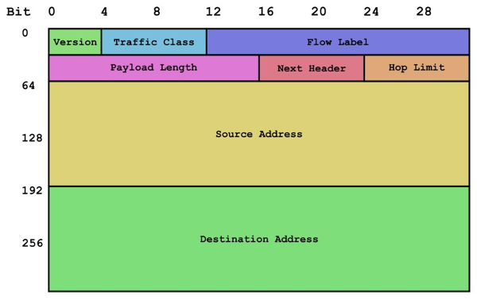

   Estructura de la cabecera de un paquete IPv6.

Un paquete en IPv6 está compuesto principalmente de dos partes: la cabecera y los datos.

La cabecera está en los primeros 40 bytes del paquete y contiene las direcciones de origen y destino (128 bits cada una), la versión de IP (4 bits), la clase de tráfico (8 bits, Prioridad del Paquete), etiqueta de flujo (20 bits, manejo de la Calidad de Servicio), longitud del campo de datos (16 bits), cabecera siguiente (8 bits), y límite de saltos (8 bits, Tiempo de Vida). Después viene el campo de datos, con los datos que transporta el paquete, que puede llegar a 64k de tamaño en el modo normal, o más con la opción "jumbo payload".

Despliegue de IPv6
++++++++++++++++++

**Mecanismos de transición a IPv6**

El cambio de IPv4 a IPv6 ya ha comenzado. Durante 20 años se espera que convivan ambos protocolos y que la implantación de IPv6 sea paulatina. Existe una serie de mecanismos que permitirán la convivencia y la migración progresiva tanto de las redes como de los equipos de usuario. En general, los mecanismos de transición pueden clasificarse en tres grupos:

- **Pila dual**
- **Túneles**
- **Traducción**

**Pila dual**

La pila dual hace referencia a una solución de nivel IP con pila dual (RFC 2893), que implementa las pilas de ambos protocolos, IPv4 e IPv6, en cada nodo de la red. Cada nodo de pila dual en la red tendrá dos direcciones de red, una IPv4 y otra IPv6.

- Pros: Fácil de desplegar y extensamente soportado.
- Contras: La topología de red requiere dos tablas de encaminamiento y dos procesos de encaminamiento. Cada nodo en la red necesita tener actualizadas las dos pilas.

**Túneles**

Los túneles permiten conectarse a redes IPv6 "saltando" sobre redes IPv4. Estos túneles trabajan **encapsulando los paquetes IPv6 en paquetes IPv4** teniendo como siguiente capa IP el protocolo número 41, y de ahí el nombre proto-41. De esta manera, los paquetes IPv6 pueden ser enviados sobre una infraestructura IPv4. Hay muchas tecnologías de túneles disponibles. La principal diferencia está en el método que usan los nodos encapsuladores para determinar la dirección a la salida del túnel.

Estas tecnologías incluyen túneles **6to4, ISATAP, y Teredo** que proporcionan la asignación de direcciones y túnel automático para el tráfico IPv6 Unicast host-to-host cuando los hosts de IPv6 deben atravesar redes IP4 para llegar a otras redes IPv6.

**Teredo** es una tecnología de transición que proporciona conectividad IPv6 a hosts que soportan IPv6 pero que se encuentran conectados a Internet mediante una red IPv4. Comparado con otros protocolos similares, la característica que lo distingue es que es capaz de realizar su función **incluso detrás de dispositivos NAT, como los routers domésticos**.

Teredo opera usando un protocolo de túneles independiente de la plataforma diseñado para proporcionar conectividad IPv6 **encapsulando los datagramas IPv6 dentro de datagramas UDP IPv4**. Estos datagramas pueden ser encaminados en Internet IPv4 y a través de dispositivos NAT. Otros nodos Teredo, también llamados Teredo relays, que tienen acceso a la red IPv6, reciben los paquetes, los desencapsulan y los encaminan.

Teredo está diseñado como una tecnología de transición con el objetivo de ser una medida temporal. En el largo plazo, todos los hosts IPv6 deberían usar la conectividad IPv6 nativa y desactivar Teredo cuando la conectividad IPv6 esté disponible.

Teredo fue desarrollado por Christian Huitema en Microsoft y fue estandarizado por la IETF como RFC 4380. El servidor teredo escucha en el **puerto UDP 3544**.

El protocolo de túneles IPv6 sobre IPv4 más común, 6to4, requiere que el final del túnel tenga una dirección IPv4 pública. Sin embargo, actualmente muchos hosts se conectan a Internet IPv4 a través de uno o varios dispositivos NAT, por lo general por el agotamiento de las direcciones IPv4. En esta situación, la única dirección IPv4 pública se asigna al dispositivo NAT y es necesario que el protocolo 6to4 esté implementado en este dispositivo. Muchos de los dispositivos NAT usados actualmente no pueden ser actualizados para implementar 6to4 por razones técnicas o económicas.

Teredo soluciona este problema encapsulando paquetes IPv6 dentro de datagramas UDP IPv4, los cuales pueden ser reenviados correctamente por NATs. Por lo tanto los hosts IPv6 que se encuentran detrás de dispositivos NAT pueden usar los túneles Teredo incluso si no disponen de una dirección IPv4 pública. Un host que implemente Teredo puede tener conectividad IPv6 sin cooperación por parte de la red local o del dispositivo NAT.

Teredo pretende ser una medida temporal. En el largo plazo todos los hosts deberían usar la conectividad nativa IPv6. El protocolo Teredo incluye una disposición para el proceso de extinción del protocolo: "Una implementación Teredo debería proporcionar una forma para dejar de usar la conectividad Teredo cuando IPv6 haya madurado y la conectividad esté disponible usando un mecanismo menos frágil".

**Miredo** es un cliente libre de túneles Teredo diseñado para permitir conectividad IPv6 a ordenadores que se encuentran en redes IPv4 y que no tienen acceso directo a una red IPv6.

**Miredo está incluido en muchas distribuciones Linux y BSD y también está disponible para las versiones recientes de Mac OS X**.

Incluye implementaciones de los tres componentes de especificación Teredo: cliente, relay y servidor.

Está liberado bajo los términos de la licencia GNU General Public License, Miredo es software libre.

**Traducción**

La traducción es necesaria cuando un nodo solo IPv4 intenta comunicar con un nodo solo IPv6.

Actualmente el protocolo IPv6 está soportado en la mayoría de los sistemas operativos modernos, en algunos casos como una opción de instalación. Linux, Solaris, Mac OS, OpenBSD, FreeBSD, Windows (2k, CE) y Symbian (dispositivos móviles) son sólo algunos de los sistemas operativos que pueden funcionar con IPv6.

Dispositivos
=============

Routers
--------

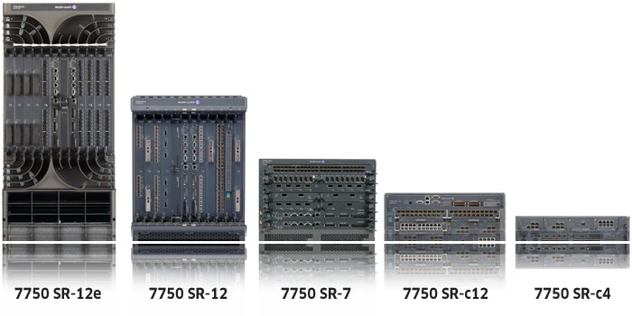

Un router —también conocido **enrutador o encaminador** de paquetes— es un dispositivo que proporciona conectividad a **nivel de red** o nivel tres en el modelo OSI. Su función principal consiste en enviar o encaminar paquetes de datos de una red a otra, es decir, interconectar subredes, entendiendo por subred un conjunto de máquinas IP que se pueden comunicar sin la intervención de un encaminador.

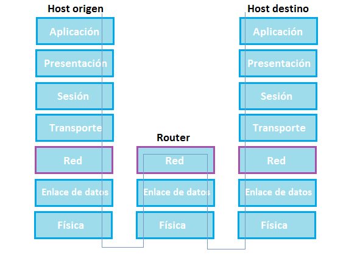

Conexiones
+++++++++++

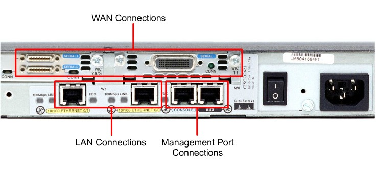

Los tres tipos básicos de conexiones de un router son:

- **interfaces LAN**
- **interfaces WAN**
- **puertos de gestión**

Las interfaces LAN permiten que el router pueda conectarse a la red de área local. Esto es por lo general algún tipo de Ethernet. Sin embargo, podría haber alguna otra tecnología LAN tales como Token Ring o modo de transferencia asíncrono (ATM).

Las conexiones de red de área amplia proporcionan conexiones a través de un proveedor de servicio a un sitio lejano o con Internet. Estos pueden ser conexiones en serie o cualquier número de otras interfaces WAN. Con algunos tipos de interfaces WAN, se requiere un dispositivo externo, para conectar el router a la conexión local del proveedor de servicios. Con otros tipos de conexiones WAN, el router puede estar conectado directamente al proveedor de servicios.

La función de los puertos de gestión es diferente de las demás conexiones. Las conexiones LAN y WAN proporcionan conexiones de red a través del cual se transmiten los paquetes. El puerto de gestión proporciona una conexión basada en texto para la configuración y solución de problemas del enrutador. Las interfaces de administración comunes son la consola y el puerto auxiliar. Estos son puertos serie asíncronos EIA- 232. Se conectan a un puerto de comunicaciones en un ordenador. El equipo debe ejecutar un programa de emulación de terminal para proporcionar una sesión basada en texto con el router. A través de esta sesión el administrador de red puede administrar el dispositivo.

Almacenamiento
++++++++++++++

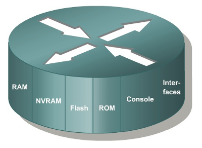

**ROM**

  La memoria de solo lectura (ROM) se utiliza para almacenar de forma permanente el código de diagnóstico de inicio (Monitor de ROM). Las tareas principales de la ROM son el diagnóstico del hardware durante el arranque del router y la carga del software IOS de Cisco desde la memoria flash a la RAM. Algunos routers también tienen una versión más básica del IOS que puede usarse como fuente alternativa de arranque. Las memorias ROM no se pueden borrar. Sólo pueden actualizarse reemplazando los chips de ROM.

**RAM**

  La memoria de acceso aleatorio (RAM) se usa para la información de las tablas de enrutamiento, el caché de conmutación rápida, la configuración actual y las colas de paquetes. En la mayoría de los routers, la RAM proporciona espacio de tiempo de ejecución para el software IOS de Cisco y sus subsistemas. Por lo general, la RAM se divide de forma lógica en memoria del procesador principal y memoria compartida de entrada / salida (I/O). Las interfaces de almacenamiento temporal de los paquetes comparten la memoria de I/O compartida. El contenido de la RAM se pierde cuando se apaga la unidad. En general, la RAM es una memoria de acceso aleatorio dinámica (DRAM) y puede actualizarse agregando más módulos de memoria en línea doble (DIMM).

**Memoria flash**

  La memoria flash se utiliza para almacenar una imagen completa del software IOS de Cisco. Normalmente el router adquiere el IOS por defecto de la memoria flash. Estas imágenes pueden actualizarse cargando una nueva imagen en la memoria flash. El IOS puede estar comprimido o no. En la mayoría de los routers, una copia ejecutable del IOS se transfiere a la RAM durante el proceso de arranque*. En otros routers, el IOS puede ejecutarse directamente desde la memoria flash. Agregando o reemplazando los módulos de memoria en línea simples flash (SIMMs) o las tarjetas PCMCIA se puede actualizar la cantidad de memoria flash.

**NVRAM**

  La memoria de acceso aleatorio no volátil (NVRAM) se utiliza para guardar la configuración de inicio. En algunos dispositivos, la NVRAM se implementa utilizando distintas memorias de solo lectura programables, que se pueden borrar electrónicamente (EEPROM).En otros dispositivos, se implementa en el mismo dispositivo de memoria flash desde donde se argó el código de arranque. En cualquiera de los casos, estos dispositivos retienen sus contenidos cuando se apaga la unidad.

Proceso de arranque de un router
++++++++++++++++++++++++++++++++

El proceso de arranque está conformado por cuatro etapas principales:

1. **Ejecución de la POST**

   La prueba de autocomprobación de encendido (POST) es un proceso común que ocurre en casi todas las computadoras durante el arranque. El proceso de POST se utiliza para probar el hardware del router. Cuando se enciende el router, el software en el chip de la ROM ejecuta el POST. Durante esta autocomprobación, el router ejecuta diagnósticos desde la ROM a varios componentes de hardware, entre ellos la CPU, la RAM y la NVRAM. Después de completarse la POST, el router ejecuta el programa bootstrap.

2. **Carga del programa bootstrap**

   Después de la POST, el programa bootstrap se copia de la ROM a la RAM. Una vez en la RAM, la CPU ejecuta las instrucciones del programa bootstrap. La tarea principal del programa bootstrap es ubicar al IOS y cargarlo en la RAM.

3. **Ubicación y carga del IOS**

   El IOS normalmente se almacena en la memoria flash, pero también puede almacenarse en otros lugares como un servidor TFTP (Trivial File Transfer Protocol).

   Si no se puede encontrar una imagen IOS completa, se copia una versión más básica del IOS de la ROM a la RAM. Esta versión del IOS se usa para ayudar a diagnosticar cualquier problema y puede usarse para cargar una versión completa del IOS en la RAM.

   Algunos de los routers más antiguos ejecutan el IOS directamente desde la memoria flash, pero los modelos actuales copian el IOS en la RAM para que la CPU lo ejecute.

4. **Ubicación y carga del archivo de configuración**

   Ubicación del archivo de configuración de inicio. Después de cargar el IOS, el programa bootstrap busca en la NVRAM el archivo de configuración de inicio, conocido como startup-config. El archivo contiene los parámetros y comandos de configuración previamente guardados, entre ellos:

   - direcciones de interfaz
   - información de enrutamiento
   - contraseñas
   - cualquier otra configuración guardada por el administrador de red

   Si el archivo de configuración de inicio, **startup-config**, se encuentra en la **NVRAM**, se copia en la RAM como el archivo de configuración en ejecución, **running-config**.

   A partir de aquí podemos conectar al router y según la plataforma y el IOS, el router podrá realizar diferentes tareas.

