Conceptos generales
===================

La capa de red transfiere datagramas entre dos ordenadores a través de la red utilizando como identificadores las direcciones IP. La capa de transporte añade la noción de puerto para distinguir entre los muchos destinos dentro de un mismo host. No es suficiente con indicar la dirección IP del destino, además hay que especificar la aplicación que recogerá el mensaje. Cada aplicación que esté esperando un mensaje utiliza un número de puerto distinto; más concretamente, la aplicación está a la espera de un mensaje en un puerto determinado (escuchando un puerto).

Pero no sólo se utilizan los puertos para la recepción de mensajes, también para el envío: todos los mensajes que envíe un ordenador debe hacerlo a través de uno de sus puertos. El siguiente diagrama representa una transmisión entre el ordenador 194.35.133.5 y el 135.22.8.165. El primero utiliza su puerto 1256 y el segundo, el 80.

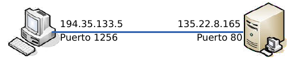

La capa de transporte transmite mensajes entre las aplicaciones de dos ordenadores. Por ejemplo, entre nuestro navegador de páginas web y un servidor de páginas web, o entre nuestro programa de correo electrónico y un servidor de correo.

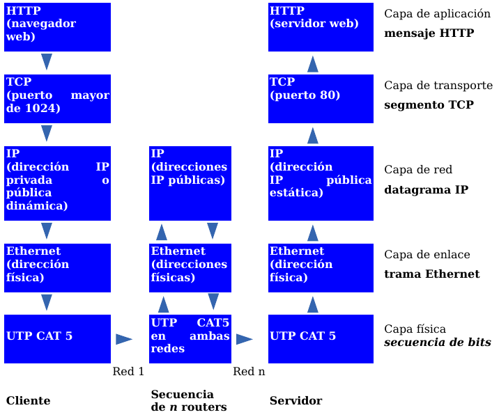

Puertos
---------

Un ordenador puede estar conectado con distintos servidores a la vez; por ejemplo, con un servidor de noticias y un servidor de correo. Para distinguir las distintas conexiones dentro de un mismo ordenador se utilizan los puertos.

Un puerto es un número de 16 bits, por lo que existen 65536 puertos en cada ordenador. Las aplicaciones utilizan estos puertos para recibir y transmitir mensajes.

La asignación de puertos puede obtenerse desde el IANA

Se pueden clasificar en:

- **Puertos bien conocidos** (Known Ports: **0 hasta 1023**).
- **Puertos registrados** (Registered Ports: **2024 hasta 49151**)
- **Puertos dinámicos y/o privados** (Dynamic and/or Private Ports: **49152 hasta 65535**)

A continuación se muestra una lista de los **puertos más importantes**.

Puertos bien conocidos
+++++++++++++++++++++++

================= ======================================================================================
Puerto/Protocolo  Descripción
================= ======================================================================================
0/udp             Reservado
20/tcp            FTP File Transfer Protocol (Protocolo de Transferencia de Ficheros) - datos
21/tcp            FTP File Transfer Protocol (Protocolo de Transferencia de Ficheros) - control
22/tcp            SSH, scp, SFTP
23/tcp            Telnet manejo remoto de equipo, inseguro
25/tcp            SMTP Simple Mail Transfer Protocol (Protocolo Simple de Transferencia de Correo)
53/tcp            DNS Domain Name System (Sistema de Nombres de Dominio)
53/udp            DNS Domain Name System (Sistema de Nombres de Dominio)
67/udp            BOOTP BootStrap Protocol (Server), también usado por DHCP
68/udp            BOOTP BootStrap Protocol (Client), también usado por DHCP
69/udp            TFTP Trivial File Transfer Protocol (Protocolo Trivial de Transferencia de Ficheros)
80/tcp            HTTP HyperText Transfer Protocol (Protocolo de Transferencia de HiperTexto) (WWW)
88/tcp            Kerberos Agente de autenticación
110/tcp           POP3 Post Office Protocol (E-mail)
123/udp           NTP Protocolo de sincronización de tiempo
123/tcp           NTP Protocolo de sincronización de tiempo
137/tcp           NetBIOS Servicio de nombres
137/udp           NetBIOS Servicio de nombres
138/tcp           NetBIOS Servicio de envío de datagramas
138/udp           NetBIOS Servicio de envío de datagramas
139/tcp           NetBIOS Servicio de sesiones
139/udp           NetBIOS Servicio de sesiones
143/tcp           IMAP4 Internet Message Access Protocol (E-mail)
161/tcp           SNMP Simple Network Management Protocol
161/udp           SNMP Simple Network Management Protocol
389/tcp           LDAP Protocolo de acceso ligero a Bases de Datos
389/udp           LDAP Protocolo de acceso ligero a Bases de Datos
443/tcp           HTTPS/SSL para la transferencia segura de páginas web
445/tcp           Microsoft-DS (Active Directory, compartición en Windows, gusano Sasser, Agobot)
445/udp           Microsoft-DS compartición de ficheros
465/tcp           SMTP Sobre SSL. Envío de correo electrónico (E-mail)
631/tcp           CUPS sistema de impresión de Unix
993/tcp           IMAP4 sobre SSL (E-mail)
995/tcp           POP3 sobre SSL (E-mail)
1023/tcp          Reservado
1023/udp          Reservado
================= ======================================================================================

Puertos registrados
++++++++++++++++++++

================= ======================================================================================
Puerto/Protocolo  Descripción
================= ======================================================================================
1024/tcp          Reservado
1024/udp          Reservado
1433/tcp          Microsoft-SQL-Server
1512/tcp          WINS Windows Internet Naming Service
2049/tcp          NFS Archivos del sistema de red
3128/tcp          HTTP web cache y por defecto en Squid cache
3306/tcp          MySQL sistema de gestión de bases de datos
3389/tcp          RDP (Remote Desktop Protocol) Terminal Server
4662/tcp          eMule (aplicación de compartición de ficheros)
4672/udp          eMule (aplicación de compartición de ficheros)
4899/tcp          RAdmin (Remote Administrator), herramienta de administración remota (normalmente troyanos)
5432/tcp          PostgreSQL sistema de gestión de bases de datos
5631/tcp          PC-Anywhere protocolo de escritorio remoto
5632/udp          PC-Anywhere protocolo de escritorio remoto
5400/tcp          VNC protocolo de escritorio remoto (usado sobre HTTP)
5500/tcp          VNC protocolo de escritorio remoto (usado sobre HTTP)
5600/tcp          VNC protocolo de escritorio remoto (usado sobre HTTP)
5700/tcp          VNC protocolo de escritorio remoto (usado sobre HTTP)
5800/tcp          VNC protocolo de escritorio remoto (usado sobre HTTP)
5900/tcp          VNC protocolo de escritorio remoto (conexión normal)
6881/tcp          BitTorrent puerto por defecto
6969/tcp          BitTorrent puerto de tracker
8080/tcp          HTTP alternativo. Proxy Web el servidor de almacenamiento en caché. Tomcat.
8118/tcp          privoxy
10000/tcp         Webmin (Administración remota web)
31337/tcp         Back Orifice herramienta de administración remota (por lo general troyanos)
49151/tcp         Reservado
49151/udp         Reservado
================= ======================================================================================

Puede encontrarse las lista completa con el servicio asociado en http://www.iana.org/assignments/service-names-port-numbers/service-names-port-numbers.xhtml

Estándares
===========

Protocolo UDP
-------------

El protocolo UDP (User Datagram Protocol, protocolo de datagrama de usuario) proporciona una comunicación muy sencilla entre las aplicaciones de dos ordenadores. Al igual que el protocolo IP, UDP es:

- **No orientado a conexión**. No se establece una conexión previa con el otro extremo para transmitir un mensaje UDP. Los mensajes se envían sin más y éstos pueden duplicarse o llegar desordenados al destino.
- **No fiable**. Los mensajes UDP se pueden perder o llegar dañados.

UDP utiliza el protocolo IP para transportar sus mensajes. Como vemos, no añade ninguna mejora en la calidad de la transferencia; aunque sí incorpora los puertos origen y destino en su formato de mensaje. Las aplicaciones (y no el protocolo UDP) deberán programarse teniendo en cuenta que la información puede no llegar de forma correcta.

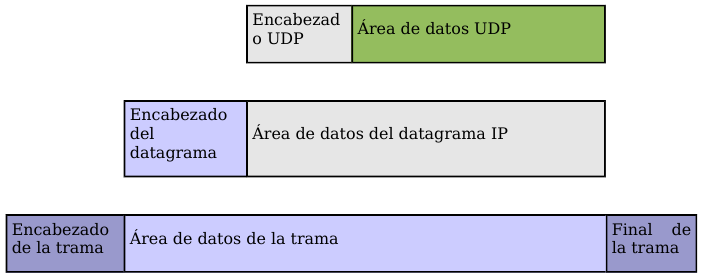

Formato de un mensaje UDP
+++++++++++++++++++++++++

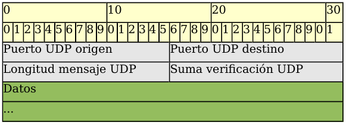

- **Puerto UDP de origen** (16 bits, opcional). Número de puerto de la máquina origen.
- **Puerto UDP de destino** (16 bits). Número de puerto de la máquina destino.
- **Longitud del mensaje UDP** (16 bits). Especifica la longitud medida en bytes del mensaje UDP incluyendo la cabecera. La longitud mínima es de 8 bytes.
- **Suma de verificación UDP** (16 bits, opcional). Suma de comprobación de errores del mensaje. Para su cálculo se utiliza una pseudo-cabecera que también incluye las direcciones IP origen y destino. Para conocer estos datos, el protocolo UDP debe interactuar con el protocolo IP.
- **Datos**. Aquí viajan los datos que se envían las aplicaciones. Los mismos datos que envía la aplicación origen son recibidos por la aplicación destino después de atravesar toda la Red de redes.

Protocolo TCP
--------------

El protocolo TCP (Transmission Control Protocol, protocolo de control de transmisión) está basado en IP que es no fiable y no orientado a conexión, y sin embargo es:

- **Orientado a conexión**. Es necesario establecer una conexión previa entre las dos máquinas antes de poder transmitir ningún dato. A través de esta conexión los datos llegarán siempre a la aplicación destino de forma ordenada y sin duplicados. Finalmente, es necesario cerrar la conexión.
- **Fiable**. La información que envía el emisor llega de forma correcta al destino.

El protocolo TCP permite una comunicación fiable entre dos aplicaciones. De esta forma, las aplicaciones que lo utilicen no tienen que preocuparse de la integridad de la información: dan por hecho que todo lo que reciben es correcto.

El flujo de datos entre una aplicación y otra viajan por un circuito virtual. Sabemos que los datagramas IP pueden seguir rutas distintas, dependiendo del estado de los encaminadores intermedios, para llegar a un mismo sitio. Esto significa que los datagramas IP que transportan los mensajes siguen rutas diferentes aunque el protocolo TCP logré la ilusión de que existe un único circuito por el que viajan todos los bytes uno detrás de otro (algo así como una tubería entre el origen y el destino). Para que esta comunicación pueda ser posible es necesario abrir previamente una conexión. Esta conexión garantiza que los todos los datos lleguen correctamente de forma ordenada y sin duplicados. La unidad de datos del protocolo es el byte, de tal forma que la aplicación origen envía bytes y la aplicación destino recibe estos bytes.

Sin embargo, cada byte no se envía inmediatamente después de ser generado por la aplicación, sino que se espera a que haya una cierta cantidad de bytes, se agrupan en un segmento y se envía el segmento completo. Para ello son necesarias unas memorias intermedias o buffers. Cada uno de estos segmentos viaja en el campo de datos de un datagrama IP. Si el segmento es muy grande será necesario fragmentar el datagrama, con la consiguiente pérdida de rendimiento; y si es muy pequeño, se estarán enviando más cabeceras que datos. Por consiguiente, es importante elegir el mayor tamaño de segmento posible que no provoque fragmentación.

El protocolo TCP envía un flujo de información no estructurado. Esto significa que los datos no tienen ningún formato, son únicamente los bytes que una aplicación envía a otra. Ambas aplicaciones deberán ponerse de acuerdo para comprender la información que se están enviando.

Cada vez que se abre una conexión, se crea un canal de comunicación bidireccional en el que ambas aplicaciones pueden enviar y recibir información, es decir, una conexión es full-dúplex.

Fiabilidad
+++++++++++

¿Cómo es posible enviar información fiable basándose en un protocolo no fiable? Es decir, si los datagramas que transportan los segmentos TCP se pueden perder, ¿cómo pueden llegar los datos de las aplicaciones de forma correcta al destino?

La respuesta a esta pregunta es sencilla: cada vez que llega un mensaje se devuelve una confirmación (acknowledgement) para que el emisor sepa que ha llegado correctamente. Si no le llega esta confirmación pasado un cierto tiempo, el emisor reenvía el mensaje.

Veamos a continuación la manera más sencilla (aunque ineficiente) de proporcionar una comunicación fiable. El emisor envía un dato, arranca su temporizador y espera su confirmación (ACK). Si recibe su ACK antes de agotar el temporizador, envía el siguiente dato. Si se agota el temporizador antes de recibir el ACK, reenvía el mensaje. Los siguientes esquemas representan este comportamiento:

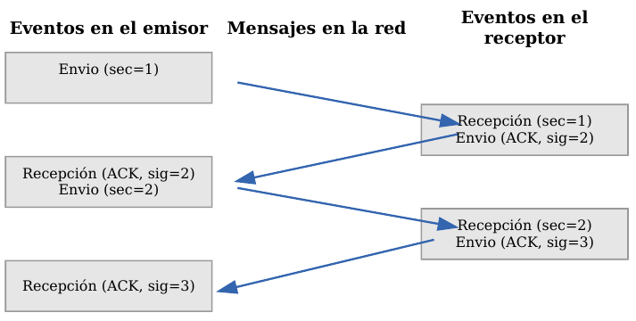

   TCP - Confirmaciones positivas (ACK)

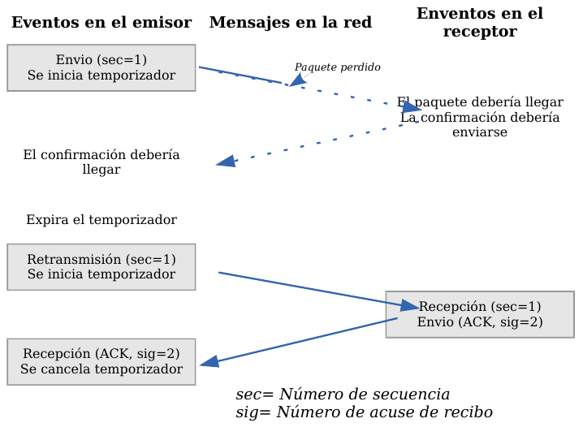

   TCP - Temporizador

Este esquema es perfectamente válido aunque muy ineficiente debido a que sólo se utiliza un sentido de la comunicación a la vez y el canal está desaprovechado la mayor parte del tiempo. Para solucionar este problema se utiliza un protocolo de ventana deslizante, que se resume en el siguiente esquema. Los mensajes y las confirmaciones van numerados y el emisor puede enviar más de un mensaje antes de haber recibido todas las confirmaciones anteriores.

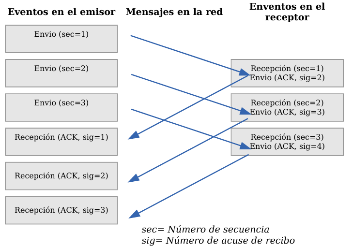

   TCP - Ventana deslizante

Conexiones
+++++++++++

Una conexión son dos pares dirección IP:puerto. No puede haber dos conexiones iguales en un mismo instante en toda la Red. Aunque bien es posible que un mismo ordenador tenga dos conexiones distintas y simultáneas utilizando un mismo puerto. El protocolo TCP utiliza el concepto de conexión para identificar las transmisiones. En el siguiente ejemplo se han creado tres conexiones. Las dos primeras son al mismo servidor Web (puerto 80) y la tercera a un servidor de FTP (puerto 21).

=================== ===================
Host 1              Host 2
=================== ===================
194.35.133.5:1256   135.22.8.165:80
184.42.15.16:1305   135.22.8.165:80
184.42.15.16:1323   135.22.10.15:21
=================== ===================

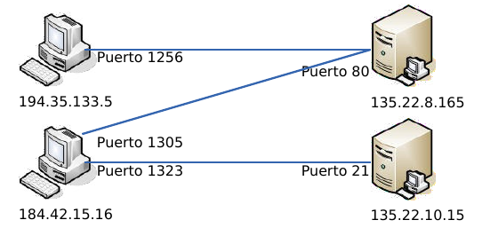

Para que se pueda crear una conexión, el extremo del servidor debe hacer una apertura pasiva del puerto (escuchar su puerto y quedar a la espera de conexiones) y el cliente, una apertura activa en el puerto del servidor (conectarse con el puerto de un determinado servidor).

.. note::
   
   El comando **NetStat** muestra las conexiones abiertas en un ordenador, así como estadísticas de los distintos protocolos de Internet.

Establecimiento de una conexión
+++++++++++++++++++++++++++++++

Antes de transmitir cualquier información utilizando el protocolo TCP es necesario abrir una conexión. Un extremo hace una apertura pasiva y el otro, una apertura activa. El mecanismo utilizado para establecer una conexión consta de tres vías.

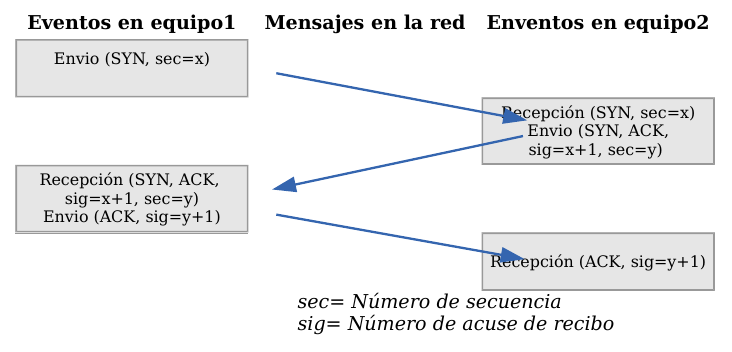

   TCP - Establecimiento de una conexión

1. La máquina que quiere iniciar la conexión hace una apertura activa enviando al otro extremo un mensaje que tenga el bit SYN activado. Le informa además del primer número de secuencia que utilizará para enviar sus mensajes.
2. La máquina receptora (un servidor generalmente) recibe el segmento con el bit SYN activado y devuelve la correspondiente confirmación. Si desea abrir la conexión, activa el bit SYN del segmento e informa de su primer número de secuencia. Deja abierta la conexión por su extremo.
3. La primera máquina recibe el segmento y envía su confirmación. A partir de este momento puede enviar datos al otro extremo. Abre la conexión por su extremo.
4. La máquina receptora recibe la confirmación y entiende que el otro extremo ha abierto ya su conexión. A partir de este momento puede enviar ella también datos. La conexión ha quedado abierta en los dos sentidos.

Observamos que son necesarios 3 segmentos para que ambas máquinas abran sus conexiones y sepan que la otra también está preparada.

.. admonition:: Números de secuencia

   Se utilizan números de secuencia distintos para cada sentido de la comunicación. Como hemos visto el primer número para cada sentido se acuerda al establecer la comunicación. Cada extremo se inventa un número aleatorio y envía éste como inicio de secuencia. Observamos que los números de secuencia no comienzan entonces en el cero. ¿Por qué se procede así? Uno de los motivos es para evitar conflictos: supongamos que la conexión en un ordenador se interrumpe nada más empezar y se crea una nueva. Si ambas han empezado en el cero es posible que el receptor entienda que la segunda conexión es una continuación de la primera (si utilizan los mismos puertos).

Cierre de una conexión
+++++++++++++++++++++++

Cuando una aplicación ya no tiene más datos que transferir, el procedimiento normal es cerrar la conexión utilizando una variación del mecanismo de 3 vías explicado anteriormente.

El mecanismo de cierre es algo más complicado que el de establecimiento de conexión debido a que las conexiones son full-duplex y es necesario cerrar cada uno de los dos sentidos de forma independiente.

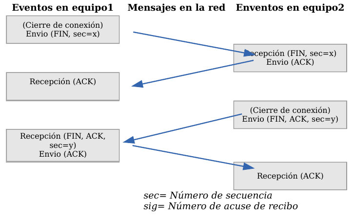

   TCP - Cierre de una conexión

1. La máquina que ya no tiene más datos que transferir, envía un segmento con el bit FIN activado y cierra el sentido de envío. Sin embargo, el sentido de recepción de la conexión sigue todavía abierto.
2. La máquina receptora recibe el segmento con el bit FIN activado y devuelve la correspondiente confirmación. Pero no cierra inmediatamente el otro sentido de la conexión sino que informa a la aplicación de la petición de cierre. Aquí se produce un lapso de tiempo hasta que la aplicación decide cerrar el otro sentido de la conexión.
3. La primera máquina recibe el segmento ACK.
4. Cuando la máquina receptora toma la decisión de cerrar el otro sentido de la comunicación, envía un segmento con el bit FIN activado y cierra la conexión.
5. La primera máquina recibe el segmento FIN y envía el correspondiente ACK. Observemos que aunque haya cerrado su sentido de la conexión sigue devolviendo las confirmaciones.
6. La máquina receptora recibe el segmento ACK.

Técnicas
=========

NAT (Network Address Translation)
----------------------------------

Es un estándar creado por la Internet Engineering Task Force (IETF) el cual utiliza una o más direcciones IP para conectar varios computadores a otra red (normalmente a Internet), los cuales tiene una dirección IP completamente distinta (normalmente una IP no válida de Internet). Por lo tanto, se puede utilizar para dar salida a redes públicas a computadores que se encuentran con direccionamiento privado o para proteger máquinas públicas.

Fue inicialmente propuesto como otra solución para la extinción de direcciones IP. Como ya sabemos para poder comunicarse en Internet se requieren direcciones IP públicas únicas (“legales”) para cada host. La idea en la que se basa NAT es que sólo una pequeña parte de la red de una organización está conectada con el exterior simultáneamente, es decir, sólo se asigna una dirección IP pública oficial a un host cuando va a comunicarse con el exterior, por tanto, solo es necesario un pequeño número de direcciones públicas. Los hosts internos pueden utilizar direcciones IP privadas (o direcciones IP no oficiales) y para los paquetes de salida el dispositivo NAT cambia la dirección origen privada por una dirección pública oficial. Igualmente para los paquetes de entrada el dispositivo NAT cambia la dirección pública por otra privada.

Funcionamiento
+++++++++++++++

El protocolo TCP/IP tiene la capacidad de generar varias conexiones simultáneas con un dispositivo remoto. Para realizar esto, dentro de la cabecera de un paquete IP, existen campos en los que se indica la dirección fuente y destino con sus respectivos puertos. Esta combinación de números define una única conexión.

Un encaminador NAT cambia la dirección fuente (lo que se conoce como SNAT, **Source NAT**) en cada paquete de salida y, dependiendo del método, también el puerto de fuente para que sea único. Estas traducciones de dirección se almacenan en una tabla, para recordar que dirección y puerto le corresponde a cada dispositivo cliente y así saber donde deben regresar los paquetes de respuesta. Si un paquete que intente ingresar a la red interna no existe en la **tabla de traducciones**, entonces es descartado. Por ello las conexiones que se inicien en el exterior (Internet) hacia el interior (Intranet) no están permitidas, lo que hace que dicho encaminador NAT tenga el “efecto secundario” de servir de cortafuegos.

Debido a este comportamiento, si queremos ofrecer al exterior (Internet) un servicio, se puede definir en la tabla que en un determinado puerto y dirección, se pueda acceder a un determinado dispositivo, como por ejemplo un servidor web, lo que se denomina NAT inverso o DNAT (**Destination NAT**).

Resumiendo:

- **SNAT - Source NAT** es cuando alteramos el origen del primer paquete: esto es, estamos cambiando el lugar de donde viene la conexión. Source NAT siempre se hace después del encaminamiento, justo antes de que el paquete salga por el cable. El enmascaramiento es una forma especializada de SNAT.

- **DNAT - Destination NAT** es cuando alteramos la dirección de destino del primer paquete: esto es, cambiamos la dirección a donde se dirige la conexión. DNAT siempre se hace antes del encaminamiento, cuando el paquete entra por el cable. El port forwarding (reenvío de puerto), el balanceo de carga y el proxy transparente son formas de DNAT.

Tipos de NAT
+++++++++++++

NAT tiene muchas formas de funcionamiento, entre las que destaca:

- **NAT estático (Static NAT)**: Realiza un mapeo en la que una dirección IP privada se traduce a una correspondiente dirección IP pública de forma unívoca. Normalmente se utiliza cuando un dispositivo necesita ser accesible desde fuera de la red privada.
- **NAT dinámico (Dynamic NAT)**: Varias direcciones IP privadas se traducen a una dirección pública. Por ejemplo, si un router posee la IP pública 194.68.10.10, esta dirección se utiliza para representar todo un rango de direcciones privadas como puede ser 192.168.1.x. Implementando esta forma de NAT se genera automáticamente un firewall entre la red pública y la privada, ya que sólo se permite la conexión que se origina desde ésta última.

Sobrecarga
++++++++++

La forma más utilizada de NAT, proviene del NAT dinámico ya que toma múltiples direcciones IP privadas (normalmente entregadas mediante DHCP) y las traduce a una única dirección IP pública utilizando diferentes puertos. Esto se conoce también como **PAT (Port Address Translation - Traducción de Direcciones por Puerto)**, NAT de única dirección o NAT multiplexado a nivel de puerto. Otra denominación es Network Address Port Translation (NAPT).

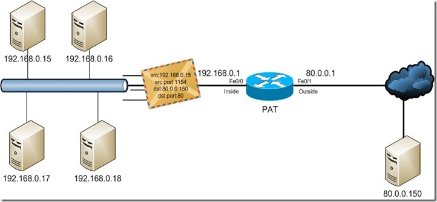

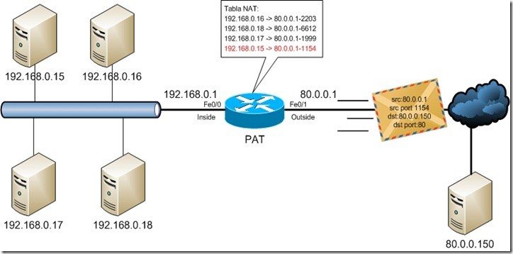

Herramientas
=============

netstat
-------

Es una herramienta que se ejecuta en modo terminal y que permite ver **los puertos que nuestro equipo tiene abiertos**.

Está disponible tanto en Windows como en Linux. A menudo se utiliza con opciones, de las cuales las más frecuentes son:

.. code-block:: none

	-a:  Muestra todas las conexiones
	-n:  Muestra números de puerto
	-p:  Muestra programa o aplicación que está usando el puerto
	-t:  Puertos TCP (sólo Linux)
	-u:  Puertos UDP(sólo Linux)
	-l:  Sólo puertos en modo escucha.

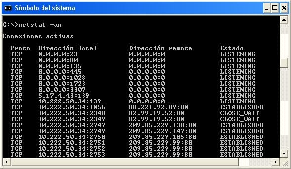

   Windows: netstat -na

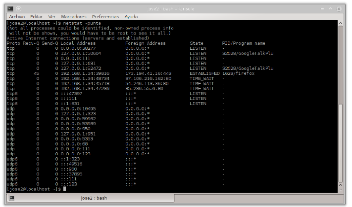

   Linux: netstat -punta

nmap
----

Es una herramienta que se ejecuta en modo terminal y que permite ver **los puertos que otro equipo tiene abiertos**. Es una herramienta disponible para Windows y Linux, aunque no viene instalada por defecto. Es necesario instalarla.

Nmap es extremadamente potente y dispone de numerosas opciones para realizar distintos tipos de sondeos o escaneos. Dichas opciones pueden consultarse en la página de manual propia.

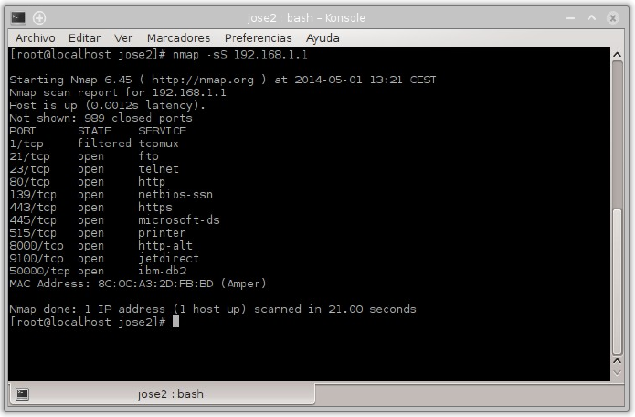

   Sondeo de puertos abiertos en 192.168.1.1

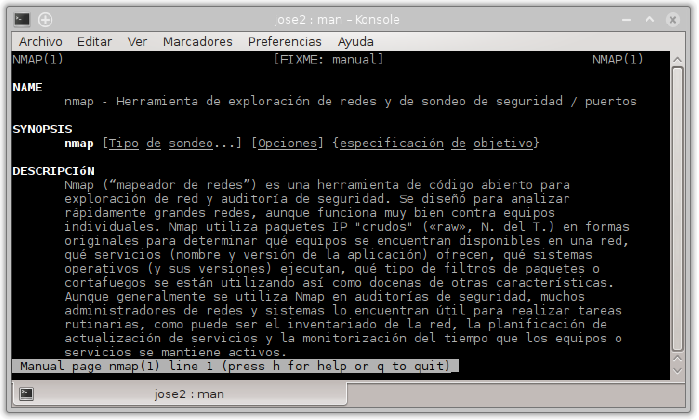

   Ayuda de nmap en Linux: man nmap

Existe un front-end gráfico conocido como **zenmap**.

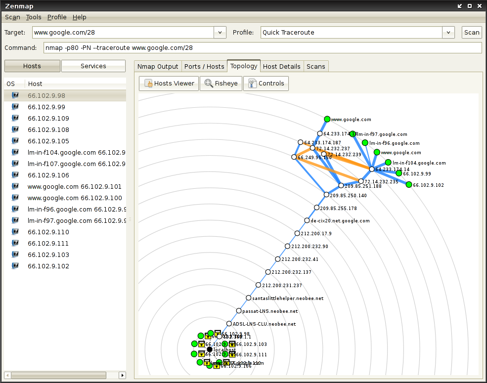

Cortafuegos
-----------

Un cortafuegos (**firewall** en inglés) es una parte de un sistema o una red que está diseñada para **bloquear el acceso no autorizado, permitiendo al mismo tiempo comunicaciones autorizadas**.

Se trata de un dispositivo o conjunto de dispositivos configurados para permitir, limitar, cifrar, descifrar, el tráfico entre los diferentes ámbitos sobre la base de un conjunto de normas y otros criterios.

Existen 2 tipos de cortafuegos:

- **Personales**
- **De red**

Los cortafuegos personales son los que el usuario final instala en su equipo con el fin de proteger dicho equipo.

Los cortafuegos de red son los que se instalan en una Intranet con el fin de proteger todos los equipos que se hallen detrás de él. Una variante de los cortafuegos de red son los cortafuegos de nivel de aplicación de tráfico HTTP, que suelen conocerse mayormente como **proxy** o **proxy-caché** (si este dispone de cacheo de páginas web), y permite que los ordenadores de una organización entren a Internet de una forma controlada.

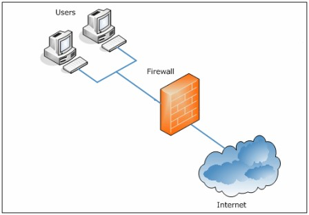

De ahora en adelante nos ocuparemos de los cortafuegos de red.

Los cortafuegos **pueden ser implementados en hardware o software, o una combinación de ambos**. Los cortafuegos se utilizan con frecuencia para evitar que los usuarios de Internet no autorizados tengan acceso a redes privadas conectadas a Internet, especialmente intranets. Todos los mensajes que entren o salgan de la intranet pasan a través del cortafuegos, que examina cada mensaje y bloquea aquellos que no cumplen los criterios de seguridad especificados. También es frecuente conectar al cortafuegos a **una tercera red, llamada «zona desmilitarizada» o DMZ**, en la que se ubican los servidores de la organización que deben permanecer accesibles desde la red exterior.

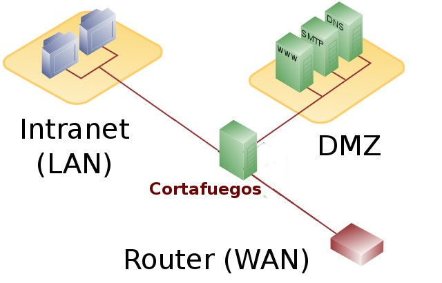

Un cortafuegos correctamente configurado añade una protección necesaria a la red, pero que en ningún caso debe considerarse suficiente. La seguridad informática abarca más ámbitos y más niveles de trabajo y protección.

Políticas del cortafuegos
++++++++++++++++++++++++++

Hay dos políticas básicas en la configuración de un cortafuegos que cambian radicalmente la filosofía fundamental de la seguridad en la organización:

- **Política restrictiva**: Se deniega todo el tráfico excepto el que está explícitamente permitido. El cortafuegos obstruye todo el tráfico y hay que habilitar expresamente el tráfico de los servicios que se necesiten. Esta aproximación es la que suelen utilizar la empresas y organismos gubernamentales.
- **Política permisiva**: Se permite todo el tráfico excepto el que esté explícitamente denegado. Cada servicio potencialmente peligroso necesitará ser aislado básicamente caso por caso, mientras que el resto del tráfico no será filtrado. Esta aproximación la suelen utilizar universidades, centros de investigación y servicios públicos de acceso a Internet.

La política restrictiva es la más segura, ya que es más difícil permitir por error tráfico potencialmente peligroso, mientras que en la política permisiva es posible que no se haya contemplado algún caso de tráfico peligroso y sea permitido por omisión.

Ejemplos de cortarfuegos para Linux
+++++++++++++++++++++++++++++++++++

- **iptables** (su sucesor será nftables)
- IPCop
- Shorewall
- SmoothWall
- UFW – Uncomplicated Firewall

Proxy-caché
-----------

El término proxy significa intermediario. Un proxy es un equipo o software intermediario que hace peticiones a distintos servidores en representación del equipo que se halla detrás de proxy haciendo uso de él. Las peticiones más frecuentes son aquellas que se realizan a páginas web aunque pueden ser de otro tipo. Pueden ser peticiones HTTP(páginas web), FTP(transferencia de archivos), DNS(resolución de nombres), ...

Cuando un proxy hace una petición a un servidor aparece como origen de la petición el mismo proxy ocultando de esta forma el equipo que realizó la petición original detrás del proxy.

Los proxies suelen disponer de una memoria denominada caché donde se van almacenando el resultado de todas las peticiones por si en un futuro próximo otro equipo detrás del proxy realizase la misma petición. Esto tiene dos ventajas:

- **Aumenta la velocidad de obtención de respuesta puesto que está almacenada en la caché**.
- **Ahorra ancho de banda puesto que dicha petición no tiene que volver a hacerse al servidor**.

Debido a que la mayoría de los proxies disponen de una caché, el término empleado para referirse a ellos es el de proxy-caché. En algún caso particular un proxy podría no disponer de caché pero, entonces, no dispondría de las ventajas indicadas anteriormente. Soló proporcionaría cierto anonimato al equipo que realiza peticiones detrás del proxy.

Resumiendo, un proxy, o servidor proxy, en una red informática, es un servidor (un programa o sistema informático), que sirve de intermediario en las peticiones de recursos que realiza un cliente (A) a otro servidor (C). Por ejemplo, si una hipotética máquina A solicita un recurso a C, lo hará mediante una petición a B, que a su vez trasladará la petición a C; de esta forma C no sabrá que la petición procedió originalmente de A. Esta situación estratégica de punto intermedio suele ser aprovechada para soportar una serie de funcionalidades: control de acceso, registro del tráfico, prohibir cierto tipo de tráfico, mejorar el rendimiento, mantener el anonimato, proporcionar Caché web, etc; este último sirve para acelerar y mejorar la experiencia del usuario.

Tipos de proxy-caché según localización
+++++++++++++++++++++++++++++++++++++++

- **Proxy local**

  En este caso el que quiere implementar la política es el mismo que hace la petición. Por eso se le llama local. Suelen estar en la misma máquina que el cliente que hace las peticiones. Son muy usados para que el cliente pueda controlar el tráfico y pueda establecer reglas de filtrado que por ejemplo pueden asegurar que no se revela información privada (Proxys de filtrado para mejora de la privacidad).

- **Proxy externo**

  El que quiere implementar la política del proxy es una entidad externa. Por eso se le llama externo. Se suelen usar para implementar cacheos, bloquear contenidos, control del tráfico, compartir IP, etc.

Tipos de proxy según su uso
++++++++++++++++++++++++++++

Los proxies que veremos a continuación son todos ellos externos.

- **Proxy HTTP, FTP, ...**

  Es el tipo de proxy más conocido. Es utilizado ampliamente como intermediario y memoria caché entre una red local e Internet. El tipo de tráfico cacheado principalmente es HTTP y FTP. A menudo se le añade un filtro de contenido con listas negras para bloqueo de determinados sitios. Puede además estar complementado con algún tipo de antivirus que comprobará todo el tráfico destinado a los equipos de la red local, con lo cual, en principio, no sería necesario de disponer de antivirus en cada PC de red, aunque si aconsejable.

  Un software muy popular para proxy-caché http es **Squid**.

- **Caché DNS**

  Un servidor de nombres (DNS) en nuestra red local no tiene porque tener configurado un dominio. La configuración más simple es aquella en la cual únicamente actúa como caché DNS (el término proxy no se suele utilizar en este caso). Una caché DNS permite a un navegador web adquirir información de DNS de dicha caché, siempre que esta información se haya almacenado en caché peticiones anteriores, sin la necesidad de acceder a los servidores DNS públicos, lo que resulta en la navegación web más rápida.

  El software más utilizado tanto de servidor DNS como caché DNS es **Bind**. Un software más ligero es **dnsmasq**.

- **Proxy inverso**

  Un servidor proxy inverso es un dispositivo de seguridad que suele desplegarse en la DMZ de una red para proteger a los servidores HTTP de una intranet corporativa, realizando funciones de seguridad que protegen a los servidores internos de ataques de usuarios en Internet.

  El servidor proxy inverso protege a los servidores HTTP internos proporcionando un punto de acceso único a la red interna.

  El administrador puede utilizar las características de autenticación y control de acceso del servidor proxy inverso para controlar quién puede acceder a los servidores internos y controlar a qué servidores puede acceder cada usuario individual.

  Todo el tráfico hacia los servidores de la intranet parece dirigido a una única dirección de red (la dirección del servidor proxy inverso).

  El administrador realiza configuraciones de correlación de URL en el servidor proxy inverso que hace esta redirección posible. Todo el tráfico enviado a los usuarios de Internet desde los servidores internos parece proceder de una única dirección de red.

  Finalmente, con algoritmos perfeccionados, el proxy inverso puede distribuir la carga de trabajo mediante la redirección de las solicitudes a otros servidores similares. Este proceso se denomina balanceo de carga. Un software muy utilizado para esto es **HAProxy**.

- **Proxy web**

  Los proxy web se utilizan para navegación anónima.

  Los equipos de una red local que disponga de un proxy-caché y filtro de contenido, pueden saltárselo mediante el uso de un proxy web. Este último, normalmente funciona sobre HTTPS puesto que dicho tipo de tráfico no es “cacheable” por el proxy de la red local. El administrador del proxy-caché de la red local, a menudo, no puede bloquear el tráfico HTTPS puesto que muchas webs (de correo, compras, administración pública, bancos, ...) utilizan dicho protocolo. La solución es elaborar una lista negra con los proxies web más conocidos y activarla en el filtro de contenido.

Cortafuegos y Proxy-caché en un sólo equipo
-------------------------------------------

Proxies transparentes
++++++++++++++++++++++

Muchas organizaciones (incluyendo empresas, colegios y familias) usan los proxies para reforzar las políticas de uso de la red o para proporcionar seguridad y servicios de caché. Normalmente, un proxy Web o NAT no es transparente a la aplicación cliente: debe ser configurada para usar el proxy, manualmente. Por lo tanto, el usuario puede evadir el proxy cambiando simplemente la configuración.

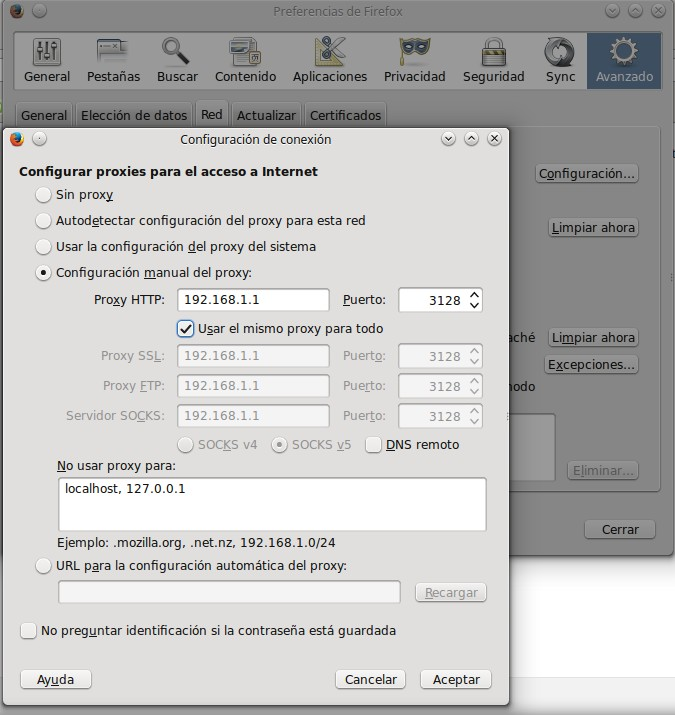

   Configuración de proxy en Firefox

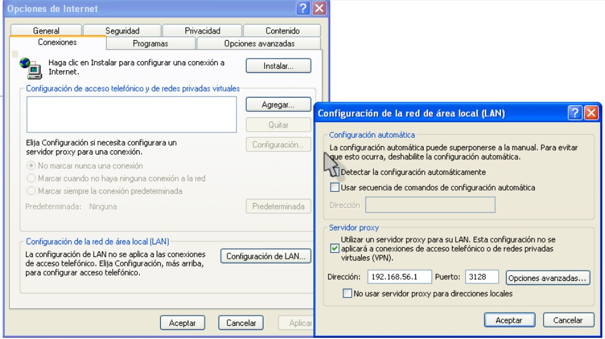

   Configuración de proxy en Internet Explorer

**Un proxy transparente combina un servidor proxy con un cortafuegos de manera que las conexiones son interceptadas y desviadas hacia el proxy sin necesidad de configuración en el cliente, y habitualmente sin que el propio usuario conozca de su existencia**.

Además, suele ser frecuente en el proxy-caché la instalación de un servicio de control de acceso a la web y algún antivirus de red. El control de acceso a la web normalmente se implementa mediante algún tipo de software de **filtrado por contenido** (además de URL e IP, puede bloquear accesos a páginas web según el contenido de estás (palabras desagradables, obscenas o similares e incluso por imágenes -aunque esté último método suele dar peores resultados-). Un software libre muy utilizado para ello es **Dansguardian** y sus listas negras asociadas.

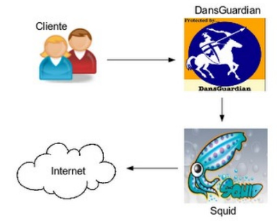

   Squid + Dansguardian.png

VPN
----

Una red privada virtual, RPV, o VPN de las siglas en inglés de Virtual Private Network, es una tecnología de red que permite una extensión segura de la red local (LAN) sobre una red pública o no controlada como Internet. Permite que la computadora en la red envíe y reciba datos sobre redes compartidas o públicas como si fuera una red privada con toda la funcionalidad, seguridad y políticas de gestión de una red privada. Esto se realiza estableciendo una conexión virtual punto a punto mediante el uso de conexiones dedicadas, cifrado o la combinación de ambos métodos.

Ejemplos comunes son la posibilidad de conectar dos o más sucursales de una empresa utilizando como vínculo Internet, permitir a los miembros del equipo de soporte técnico la conexión desde su casa al centro de cómputo, o que un usuario pueda acceder a su equipo doméstico desde un sitio remoto, como por ejemplo un hotel. Todo ello utilizando la infraestructura de Internet.

El protocolo estándar de facto es el **IPSEC**, pero también están PPTP, L2F, L2TP, **SSL/TLS**, SSH, etc. Cada uno con sus ventajas y desventajas en cuanto a seguridad, facilidad, mantenimiento y tipos de clientes soportados.

Aplicaciones software muy conocidas son **Hamachi** para uso doméstico y **OpenVPN** para uso en empresas.

Básicamente existen 2 tipos de conexión VPN:

- **VPN de acceso remoto**

  Es quizás el modelo más usado actualmente, y consiste en usuarios o proveedores que se conectan con la empresa desde sitios remotos (oficinas comerciales, domicilios, hoteles, aviones preparados, etcétera) utilizando Internet como vínculo de acceso. Una vez autenticados tienen un nivel de acceso muy similar al que tienen en la red local de la empresa. Muchas empresas han reemplazado con esta tecnología su infraestructura dial-up (módems y líneas telefónicas).

- **VPN punto a punto**

  Este esquema se utiliza para conectar oficinas remotas con la sede central de la organización. El servidor VPN, que posee un vínculo permanente a Internet, acepta las conexiones vía Internet provenientes de los sitios y establece el túnel VPN. Los servidores de las sucursales se conectan a Internet utilizando los servicios de su proveedor local de Internet, típicamente mediante conexiones de banda ancha. Esto permite eliminar los costosos vínculos punto a punto tradicionales (realizados comúnmente mediante conexiones de cable físicas entre los nodos), sobre todo en las comunicaciones internacionales. Es más común el siguiente punto, también llamado tecnología de túnel o tunneling.

.. admonition:: Tunneling

   La técnica de tunneling consiste en encapsular un protocolo de red sobre otro (protocolo de red encapsulador) creando un túnel dentro de una red de computadoras. El establecimiento de dicho túnel se implementa incluyendo una PDU (unidades de datos de protocolo) determinada dentro de otra PDU con el objetivo de transmitirla desde un extremo al otro del túnel sin que sea necesaria una interpretación intermedia de la PDU encapsulada. De esta manera se encaminan los paquetes de datos sobre nodos intermedios que son incapaces de ver en claro el contenido de dichos paquetes. El túnel queda definido por los puntos extremos y el protocolo de comunicación empleado, que entre otros, podría ser SSH.

